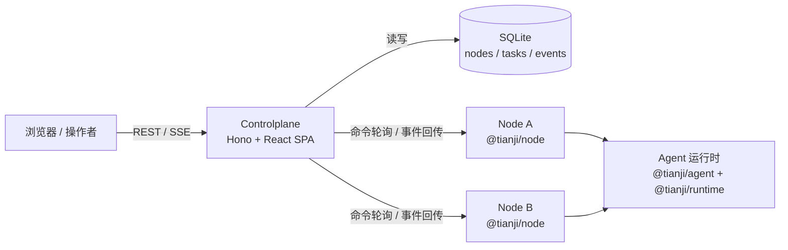
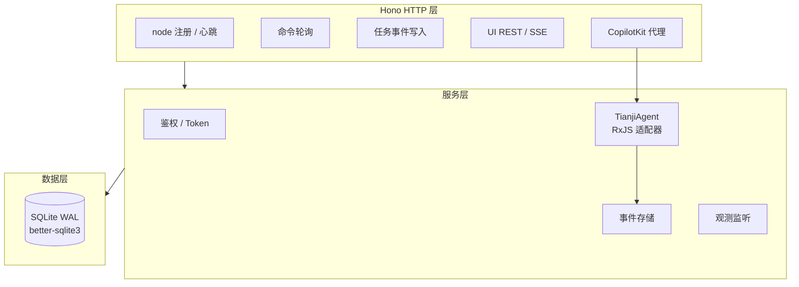
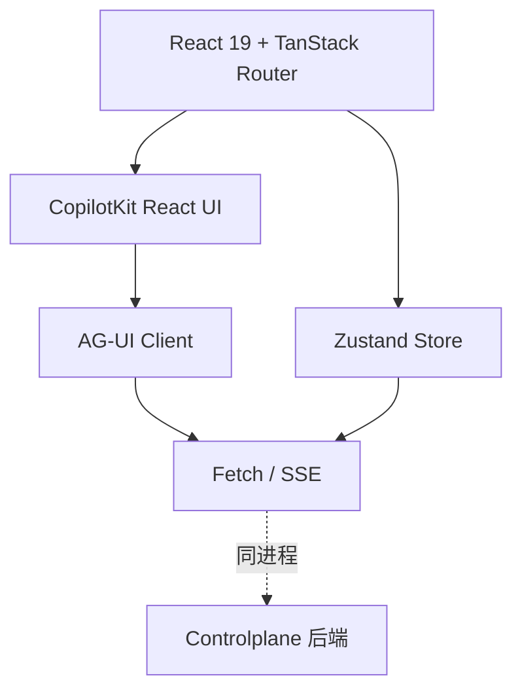

# @tianji/controlplane

`@tianji/controlplane` 是 `tianji-ai` 的**中央控制平面**：一个把后端服务与浏览器前端打包在同一进程里的混合型应用。它承担 node 节点注册与生命周期管理、任务派发、事件溯源存储，并通过 SSE 把任务执行过程推送回浏览器。

Controlplane 自身不执行模型调用。所有 AI 任务都被派发到在线的 node 去执行，controlplane 只做协调、路由和可观测性。

## 在整体架构中的位置



| 角色 | 职责 |
|---|---|
| Controlplane | 协调者：注册、鉴权、任务编排、事件汇聚、UI |
| Node | 执行者：拉取命令、运行 agent、回传事件流 |
| Agent / Runtime | 推理与工具执行的业务包，被 node 加载 |
| Shared | 跨进程的 RPC 类型与协议定义 |
| Observer | 统一日志基础设施 |

## 顶层设计原则

| 原则 | 说明 |
|---|---|
| 控制与执行分离 | Controlplane 只做协调，模型调用、工具执行全部下沉到 node |
| 轮询 + 事件回传 | Node 主动拉命令、主动上报事件，controlplane 不反向连接 node，天然适配内网穿透场景 |
| 事件溯源 | 任务执行过程以事件流持久化到 SQLite，前端通过 SSE 订阅同一份事件，刷新即可重放 |
| 单进程部署 | 后端 Hono 在同一端口同时提供 REST、SSE 和 SPA 静态资源，运维面简单 |
| 无重 ORM | 直接手写 SQL + migration 文件管理 schema，避免 ORM 抽象成本 |
| Token 分层鉴权 | Enrollment Token 只用于首次注册，后续心跳与命令轮询使用单 node 独立的 Access Token |

---

## 后端

### 架构



### 主要依赖框架

| 依赖 | 作用 |
|---|---|
| Hono + @hono/node-server | HTTP / SSE 服务器 |
| better-sqlite3 | 同步 SQLite 驱动，WAL 模式 |
| RxJS | 任务事件流在服务端的组合与背压 |
| @copilotkit/runtime | 作为 CopilotKit 的后端代理，衔接前端 Agent UI |
| @ag-ui/client | AbstractAgent 抽象，TianjiAgent 在此之上实现 |
| @tianji/shared | 与 node / 前端共享的 RPC 类型 |
| @tianji/observer | 结构化日志 |

### 后端目录

```text
src/
├─ server.ts          # 进程入口：加载环境变量、初始化 DB、启动 Hono
├─ app.ts             # 路由与中间件装配
├─ db/                # SQLite 初始化、连接管理、schema 定义
├─ routes/            # 按能力划分的 Hono 子路由
│  ├─ register / heartbeat / poll   # node 侧 REST
│  ├─ events                        # 任务事件写入
│  ├─ ui-nodes                      # UI 读取节点列表
│  └─ copilot                       # CopilotKit 运行时代理与任务创建入口
├─ middleware/        # Access Token 校验、请求日志
├─ services/          # EventStore、ObservationMonitor、Auth
└─ agents/            # TianjiAgent：把 node 任务事件桥接到 CopilotKit
migrations/           # 手写 SQL migration 文件，按序执行
```

### 核心交互时序

1. Node 使用一次性 Enrollment Token 调用注册接口，换取专属 Access Token。
2. Node 周期性上报心跳，同步在线状态与本机可用 agent 列表。
3. 浏览器选择 node + agent，通过 `/api/copilot` 发起一次 Copilot 运行；`TianjiAgent.run()` 在 controlplane 内部写入 `commands` / `tasks`。
4. Node 轮询命令接口，拿到任务后本地执行。
5. Node 把执行过程以事件流回传到事件接口，controlplane 持久化到 `event_log`。
6. CopilotRuntime 消费同一条事件流并把任务过程推送回前端；刷新后仍可基于事件重放。

---

## 前端

### 架构



前端是 Vite 打包的单页应用，产物由后端直接托管。它对外只依赖 controlplane 自己的 `/api/*` 接口，没有跨域场景。

### 主要依赖框架

| 依赖 | 作用 |
|---|---|
| React 19 | UI 框架 |
| TanStack Router | 路由 |
| Zustand | 轻量状态管理 |
| @copilotkit/react-core / react-ui | Agent 对话与流式渲染的前端运行时 |
| @ag-ui/client | Agent 协议客户端抽象 |
| Vite | 开发与构建工具 |
| @tianji/shared | 与后端共享类型，避免前后端字段漂移 |

### 前端目录

```text
src/web/
├─ main.tsx           # SPA 入口
├─ router/            # TanStack Router 路由定义与页面
├─ components/        # 展示与交互组件，包含 CopilotKit 封装
├─ stores/            # Zustand store：节点列表、当前任务等
├─ services/          # 对节点列表等 /api/* 接口的调用封装
└─ styles/            # 样式
```

### 前端职责

| 模块 | 职责 |
|---|---|
| 节点视图 | 从 `/api/ui/nodes` 拉取在线节点与其 agent 列表 |
| 任务创建 | 选择 node + agent，通过 `/api/copilot` 发起 Copilot 运行，由后端内部创建 task / command |
| 任务流 | 通过 CopilotRuntime 返回的事件流实时渲染执行过程，支持基于事件重放 |
| CopilotKit 集成 | 把 controlplane 暴露的 `/api/copilot` 作为 CopilotKit 后端，TianjiAgent 负责把 node 任务适配成 CopilotKit 能理解的事件流 |

---

## 事件系统

tianji-ai 使用 Core / Integration / Protocol 三层事件架构：

- Core：聚合根发射纯 DomainEvent（PascalCase，如 `RunStarted`）。
- Integration：统一 `DomainEventEnvelope` 信封，`correlationId + causationId + sequence` 三件套。
- Protocol：AG-UI / ACP / Daemon SSE / OTel / Observer 都是 EventBus 订阅者。

旧 `RuntimeEvent` / `TaskEvent` 已移除。详见 `docs/superpowers/specs/2026-04-14-event-bus-design.md`。

## 升级步骤

**每次升级 controlplane 前，必须先执行：**

```bash
pnpm --filter @tianji/controlplane migrate
```

该命令会扫描 `apps/controlplane/migrations/` 目录，把尚未应用的 SQL 文件按文件名顺序逐一执行，并记录执行状态以避免重复运行。本次升级包含 `20260414-drop-task-events.sql`，会删除旧版遗留的 `task_events` 表。

如果跳过此步骤，旧 `task_events` 空表会继续留在数据库中。功能不受影响，但与当前代码的语义不一致，后续排查问题时容易产生混淆。

---

## 运行与运维入口

顶层设计以外的具体命令、环境变量、token 生成、数据库迁移等内容，放在仓库级使用文档：

- 使用说明：[`../../docs/usage/controlplane.md`](../../docs/usage/controlplane.md)
- Node 使用说明：[`../../docs/usage/node.md`](../../docs/usage/node.md)
- 架构设计：[`../../docs/development/01 - ARCHITECTURE.md`](../../docs/development/01%20-%20ARCHITECTURE.md)
