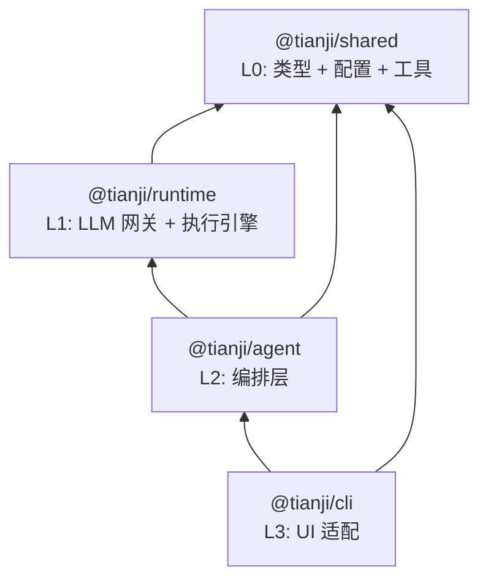

# Tianji AI 架构设计文档

> 状态：当前
> 日期：2026-03-30
> 相关文档：[`./CONFIG_DESIGN.md`](./CONFIG_DESIGN.md)、[`./RUNTIME_DESIGN.md`](./RUNTIME_DESIGN.md)、[`./OBSERVER_DESIGN.md`](./OBSERVER_DESIGN.md)、[`./AGENT_DESIGN.md`](./AGENT_DESIGN.md)、[`./CLI_GUIDE.md`](./CLI_GUIDE.md)、[`./DEVELOPMENT.md`](./DEVELOPMENT.md)
> 目标：4 个包 (shared + runtime + agent + cli) 的分层架构，明确职责、减少包间耦合、为多 agent 编排预留扩展空间。

---

## 1. 动机与目标

### 1.1 V1 回顾

V1 建立了清晰的 5 层架构：

```
contracts(零依赖协议) → shared(配置/工具) → llm(AI SDK 网关) → runtime(会话执行) → cli(UI)
```

这套分层在早期验证了核心运行链路，但随着实际开发推进，暴露出以下问题：

**contracts 与 shared 边界模糊**

contracts 定义纯类型，shared 定义 Zod schema 和工具函数，两者都是"轻量基础层"。实践中消费方几乎总是同时 import 两个包，增加了不必要的依赖声明。contracts 零依赖的设计约束在实际使用中没有带来显著收益，反而导致类型定义和 schema 验证分属两处，维护成本上升。

**llm 作为独立包的价值递减**

llm 包的唯一消费者是 runtime。AI SDK gateway 本质上是 runtime 的内部实现细节，不需要也不应该被应用层直接使用（V1 依赖矩阵已明确禁止 apps 依赖 llm）。独立成包增加了发布、版本、类型同步的维护负担，却没有带来额外的复用价值。

**缺少编排层**

当前 CLI 直接构建 `SessionRuntime`、组装配置上下文、注入环境变量、加载 `SOUL.md`。这些"配置组装 + agent 启动"逻辑不属于 UI 层职责，也不属于底层 runtime。如果将来增加 Web、Bot 等入口，这些逻辑需要重复实现。更重要的是，未来的多 agent 路由、规划、通信需要独立的扩展空间，不应塞入 runtime 也不应散落在各个 app 中。

### 1.2 V2 目标

- 将 contracts 合并入 shared，形成单一的"类型 + 配置 + 工具函数"基础层
- 将 llm 合并入 runtime，AI SDK 成为 runtime 的内部实现
- 新增 agent 包，承载配置组装、runtime 启动封装、未来多 agent 编排
- CLI 瘦身为 UI 适配层，不再直接创建 runtime；协议类型继续来自 shared（或由 agent 再导出）
- 保持现有运行链路的功能不变：配置加载、placeholder 解析、session 执行、事件流

### 1.3 非目标

- 不改变配置系统的设计（三层 JSON + env placeholder 继续沿用）
- 不改变 runtime 的核心执行引擎（deepagents 引擎保持不变）
- 不改变 contracts 中已冻结的协议语义（事件类型、delta 语义、snapshot 结构）
- 不在 V2 实现完整的多 agent 编排，只预留架构空间

---

## 2. V2 包结构

```text
tianji-ai/
├─ packages/
│  ├─ shared/       # L0: 类型 + 配置 schema + 工具函数（合并原 contracts + shared）
│  ├─ runtime/      # L1: LLM 网关 + 会话执行引擎（合并原 llm + runtime）
│  └─ agent/        # L2: 编排层：配置组装、chat API、多 agent 路由(待实现)
├─ apps/
│  └─ cli/          # L3: 纯 UI 适配层
```

### 与 V1 对比

| 维度 | V1 | V2 |
|------|----|----|
| 包数量 | 4 packages + 1 app | 3 packages + 1 app |
| 层数 | 5 层 (contracts, shared, llm, runtime, cli) | 4 层 (shared, runtime, agent, cli) |
| 基础类型来源 | contracts + shared 两个包 | shared 一个包 |
| LLM 网关可见性 | 公开包 (`@tianji/llm`) | runtime 内部模块 |
| 配置组装位置 | cli 内部 | agent 包 |
| 应用层直接创建 runtime | 是 | 否（通过 agent 封装） |

---

## 3. 各包职责详述

### 3.1 `@tianji/shared` — L0 基础层

**来源**：将原 `contracts` 协议层合并入 `@tianji/shared`

**职责**：

- 公共领域协议：`SessionId`, `ThreadId`, `RunId`, `AppMessage`, `RuntimeEvent`, `ToolSpec`, errors, deltas, snapshots, artifacts, policy
- 配置 Zod schema：`TianjiConfig`, providers, agents, runtime, observer
- 占位符解析：`${env:VAR_NAME}` 语法
- 配置纯函数：`mergeTianjiConfigLayers` 等不触及文件系统的配置变换逻辑
- 默认配置常量
- Agent 辅助函数：`parseAgentModelRef`, `getDefaultAgentDefinition`, `getAgentSoulPath`, `loadAgentSoul`
- 通用工具：`deepClone`, `sleep`, `retry`
- Delta 聚合器：`applyMessageDelta`, `isComplete`

**依赖约束**：

| 允许的外部依赖 | 允许的内部依赖 | 禁止依赖 |
|--------------|--------------|---------|
| `zod` | 无 | 所有内部包, `ai`, `@ai-sdk/*`, `@langchain/*`, `deepagents` |

**设计说明**：contracts 原本要求零外部依赖。合并后 shared 依赖 zod，但纯类型导出（如 `SessionId`, `AppMessage`）在编译后不产生运行时代码，zod 只被 schema 校验路径使用。如果未来需要在浏览器端极致 tree-shake，可以通过 subpath exports 分离 `@tianji/shared/types` 和 `@tianji/shared/config`。shared 只承载纯类型、schema 与纯函数，不负责配置文件路径解析、文件读取或运行期错误包装；这些仍属于 runtime 的配置中心职责。

### 3.2 `@tianji/runtime` — L1 执行层

**来源**：合并原 `@tianji/llm` + `@tianji/runtime`

**职责**：

- **LLM 网关**（作为内部模块，不再公开导出网关接口）：
  - `LlmGateway`, `LlmStream`, provider 工厂, 消息转换, tool schema bridge, usage 收集
- **中心化配置加载器**：`loadResolvedConfig`, `resolveConfigPaths`, `RuntimeConfigError`
  - 负责配置文件路径解析、三层 JSON 读取、最终错误包装
  - 复用 shared 提供的 schema、placeholder 和配置纯函数，避免在 runtime 内重复维护等价逻辑
- **会话运行时**：`createSessionRuntime`, `SessionRuntime`
- **事件流**：`ReplayableEventStream`
- **快照存储**：`SnapshotStore`, `FileSnapshotStore`, `InMemorySnapshotStore`
- **工具注册与策略**：`ToolRegistry`, `ToolCatalog`, `ensureToolAllowed`
- **执行引擎**：`deepagents-engine`
- **模型适配收敛点**：runtime 中现有的 provider-specific 模型构造逻辑（如 OpenAI baseUrl/headers 适配）也应一并收敛到 `src/llm/` 内部模块，而不是继续散落在 runtime 核心入口

**依赖约束**：

| 允许的外部依赖 | 允许的内部依赖 | 禁止依赖 |
|--------------|--------------|---------|
| `ai`, `@ai-sdk/*`, `@langchain/*`, `langchain`, `deepagents`, `zod` | `@tianji/shared` | `@tianji/agent`, `apps/*` |

**公共 API 变化**：

- 不再导出 `LlmGateway`, `LlmStream`, `LlmProvider` 等 LLM 层接口类型——成为 runtime 内部实现
- 继续导出 `createSessionRuntime`, `SessionRuntime`, `ResolvedConfig`, `loadResolvedConfig` 等稳定 API
- 继续导出 `SnapshotStore`, `ToolRegistry`, `ReplayableEventStream` 等
- `LlmGenerationConfig` 如果继续被 `RunTurnOptions` 引用，需要同步确定归属：迁入 shared，或直接内联为 runtime 公共类型；不要保留对已删除包的类型依赖

**内部模块组织**（建议）：

```text
packages/runtime/src/
├─ index.ts              # 公共导出
├─ config.ts             # 中心化配置加载
├─ runtime.ts            # SessionRuntime 核心
├─ event-stream.ts       # 事件流
├─ snapshot-store.ts     # 快照存储
├─ tool-catalog.ts       # 工具注册
├─ engines/
│  └─ deepagents-engine.ts
└─ llm/                  # 原 @tianji/llm 内容，内部模块
   ├─ index.ts           # 内部 barrel（不从 runtime index 公开）
   ├─ factory.ts
   ├─ sdk-gateway.ts
   ├─ openai-gateway.ts
   ├─ anthropic-gateway.ts
   ├─ google-gateway.ts
   ├─ message-conversion.ts
   ├─ tool-schema-bridge.ts
   └─ usage.ts
```

### 3.3 `@tianji/agent` — L2 编排层（新增）

**来源**：从 `apps/cli/src/config.ts` 和 `apps/cli/src/main.ts` 中提取的配置组装、首次初始化与 runtime 启动逻辑

**职责**：

- **配置上下文组装**：将 runtime 的 `ResolvedConfig` 转化为可执行的 agent 上下文（解析默认 agent、加载 SOUL.md、构建 provider 配置）
- **runtime 启动封装**：封装"从上下文创建 SessionRuntime / Session / runTurn 输入"的流程，避免应用层直接组装 deepagents 运行参数
- **高层 chat API**：可选地提供更简洁的"创建 session → runTurn → 消费事件流"封装，但它是糖衣层，不替代底层启动原语
- **Provider 环境注入**：作为兼容当前 provider SDK 行为的过渡桥接保留在 agent；长期目标应是 runtime/llm 仅消费显式 provider 配置，而不是依赖 `process.env` 副作用
- **首次运行初始化**：`ensureDefaultUserConfig` 逻辑
- **未来扩展空间**：多 agent 路由、agent 间通信、规划器

**关键接口设计**（建议）：

```typescript
// 配置组装
export interface AgentContext {
  readonly agentName: string
  readonly modelRef: string
  readonly provider: string
  readonly modelName: string
  readonly providerConfig: TianjiProviderConfig | undefined
  readonly soulPath: string
  readonly soul: string
}

export interface LoadedAgentContext {
  readonly paths: AgentAppPaths
  readonly config: TianjiConfig
  readonly agent: AgentContext
  readonly resolvedEnvVars: readonly string[]
  readonly snapshotStore: SnapshotStore
}

export interface AgentAppPaths {
  readonly configDir: string
  readonly agentsDir: string
  readonly logsDir: string
  readonly configFilePath: string
  readonly cliLogFilePath?: string
}

// 启动原语
export function loadAgentContext(
  options?: LoadAgentContextOptions,
): Promise<LoadedAgentContext>

export function createAgentRuntime(
  context: LoadedAgentContext,
): SessionRuntime

export function createAgentSession(
  context: LoadedAgentContext,
): AgentSession

export interface AgentSession {
  readonly chat: (
    prompt: string,
    options?: ChatOptions,
  ) => AsyncIterable<RuntimeEvent>
  readonly sessionId: SessionId
}
```

**依赖约束**：

| 允许的外部依赖 | 允许的内部依赖 | 禁止依赖 |
|--------------|--------------|---------|
| `zod`（可选） | `@tianji/shared`, `@tianji/runtime` | `ai`, `@ai-sdk/*`, `@langchain/*`, Provider SDK, `apps/*` |

**设计说明**：agent 的核心价值是把"最终配置"映射为"可执行的 runtime 输入"。它可以额外提供高层 chat API，但不应把所有调用方都强制绑定到单一的 `chat()` 抽象；CLI、Web、Bot 可以共享 context/runtime 装配逻辑，再按各自入口决定如何消费 `RuntimeEvent`。

### 3.4 `@tianji/cli` — L3 UI 层

**来源**：保留 `apps/cli`，但大幅瘦身

**职责**：

- CLI 参数解析（`parseCliArgs`）
- `tianji run` / `tianji log -f` 命令路由
- 终端输出格式化（event → stdout）
- CLI 日志系统（`CliLogger`, JSONL 日志）

**依赖约束**：

| 允许的外部依赖 | 允许的内部依赖 | 禁止依赖 |
|--------------|--------------|---------|
| `@types/node` | `@tianji/agent`, `@tianji/shared` | `@tianji/runtime`, `ai`, `@ai-sdk/*`, `@langchain/*`, Provider SDK |

**变化要点**：

- 移除 `config.ts` 中的配置组装逻辑（迁移到 agent）
- 将 `injectProviderEnv` 迁移到 agent 作为过渡桥接，而不是长期 UI 责任
- 移除 `createCliRuntime`（被 agent 的 `createAgentRuntime` / `createAgentSession` 替代）
- `main.ts` 中的 `handleRunCommand` 简化为调用 agent 包的上下文装配与启动 API
- CLI 是否仍直接 import `RuntimeEvent`、`AppMessage` 等协议类型，不由本文强制规定；可继续从 shared 获取，或由 agent 再导出统一入口

---

## 4. V2 依赖图



文字表示：

```
shared (类型, schema, 纯函数；零内部依赖)
    ↑
runtime (配置加载, 执行引擎, llm 内部模块, shared)
    ↑
agent (上下文装配, 启动封装, 过渡桥接)
    ↑
cli (命令解析, 日志, 终端输出)
```

---

## 5. 依赖矩阵与强制约束

| 包 | 允许的内部依赖 | 允许的外部依赖 | 禁止依赖 |
|----|--------------|--------------|---------|
| `@tianji/shared` | 无 | `zod` | 所有内部包, `ai`, `@ai-sdk/*`, `@langchain/*`, `deepagents` |
| `@tianji/runtime` | `@tianji/shared` | `ai`, `@ai-sdk/*`, `@langchain/*`, `langchain`, `deepagents`, `zod` | `@tianji/agent`, `apps/*` |
| `@tianji/agent` | `@tianji/shared`, `@tianji/runtime` | `zod`（可选） | `ai`, `@ai-sdk/*`, `@langchain/*`, Provider SDK, `apps/*` |
| `@tianji/cli` | `@tianji/agent`, `@tianji/shared` | `@types/node` | `@tianji/runtime`, `ai`, `@ai-sdk/*`, `@langchain/*`, Provider SDK |

**实施手段**（与 V1 一致）：

- `package.json#exports` 限制 deep import
- CI lint 检查禁止违规依赖
- 对 `@tianji/shared` 持续执行"零内部包依赖"检查
- 对 `@tianji/agent` 和 `@tianji/cli` 执行"禁止直接使用框架依赖"检查

**补充约束**：如果 CLI 仍需消费 `RuntimeEvent`、`AppMessage` 等协议类型，应继续从 shared 获取，或由 agent 统一再导出；但 CLI 不应再直接 import runtime 创建或配置装配原语。

---

## 6. 迁移路径：V1 → V2 文件级映射

### 6.1 contracts → shared

| V1 文件 | V2 目标位置 | 操作 |
|---------|------------|------|
| `packages/contracts/src/identifiers.ts` | `packages/shared/src/identifiers.ts` | 移动 |
| `packages/contracts/src/errors.ts` | `packages/shared/src/errors.ts` | 移动 |
| `packages/contracts/src/events.ts` | `packages/shared/src/events.ts` | 移动 |
| `packages/contracts/src/message.ts` | `packages/shared/src/message.ts` | 移动 |
| `packages/contracts/src/tool.ts` | `packages/shared/src/tool.ts` | 移动 |
| `packages/contracts/src/policy.ts` | `packages/shared/src/policy.ts` | 移动 |
| `packages/contracts/src/delta.ts` | `packages/shared/src/delta.ts` | 移动 |
| `packages/contracts/src/delta-aggregator.ts` | `packages/shared/src/delta-aggregator.ts` | 移动 |
| `packages/contracts/src/artifact.ts` | `packages/shared/src/artifact.ts` | 移动 |
| `packages/contracts/src/snapshot.ts` | `packages/shared/src/snapshot.ts` | 移动 |
| `packages/contracts/src/index.ts` | 合并入 `packages/shared/src/index.ts` | 合并导出 |
| `packages/contracts/package.json` | — | 删除包 |

shared 的 `index.ts` 需要重新导出所有原协议层的公共符号。全局替换 `from '@tianji/contracts'` 为 `from '@tianji/shared'`。同时迁移原 `packages/contracts/src/__tests__/*`，并同步更新所有相关 README、入口测试和 `package.json` 断言。

### 6.2 llm → runtime

| V1 文件 | V2 目标位置 | 操作 |
|---------|------------|------|
| `packages/llm/src/factory.ts` | `packages/runtime/src/llm/factory.ts` | 移动 |
| `packages/llm/src/sdk-gateway.ts` | `packages/runtime/src/llm/sdk-gateway.ts` | 移动 |
| `packages/llm/src/openai-gateway.ts` | `packages/runtime/src/llm/openai-gateway.ts` | 移动 |
| `packages/llm/src/anthropic-gateway.ts` | `packages/runtime/src/llm/anthropic-gateway.ts` | 移动 |
| `packages/llm/src/google-gateway.ts` | `packages/runtime/src/llm/google-gateway.ts` | 移动 |
| `packages/llm/src/message-conversion.ts` | `packages/runtime/src/llm/message-conversion.ts` | 移动 |
| `packages/llm/src/tool-schema-bridge.ts` | `packages/runtime/src/llm/tool-schema-bridge.ts` | 移动 |
| `packages/llm/src/usage.ts` | `packages/runtime/src/llm/usage.ts` | 移动 |
| `packages/llm/src/index.ts` | `packages/runtime/src/llm/index.ts`（内部 barrel） | 改为内部 |
| `packages/llm/package.json` | — | 删除包 |

runtime 内部原来的 `import { ... } from '@tianji/llm'` 改为 `import { ... } from './llm/index.js'`。同时把 runtime 核心里现有的 provider-specific 模型构造逻辑也收敛到 `src/llm/`，避免只迁文件、不迁边界。

runtime 的 `index.ts` 不再公开导出 LLM 网关类型。`packages/runtime/src/__tests__/index.test.ts`、`packages/runtime/README.md` 等依赖矩阵断言也需要在本阶段同步改写。

### 6.3 cli 配置逻辑 → agent

| V1 位置 | V2 目标位置 | 操作 |
|---------|------------|------|
| `apps/cli/src/config.ts` 中的 `LoadedAgentConfig`, `LoadedUserConfigContext`, `ensureDefaultUserConfig`, `loadUserConfigContext`, `injectProviderEnv`, `PROVIDER_ENV_KEY_MAP` | `packages/agent/src/context.ts` | 提取并迁移 |
| `apps/cli/src/main.ts` 中的 `createCliRuntime`, `createCliModel`, `executeRunTurn` 核心逻辑 | `packages/agent/src/session.ts` | 提取启动原语，并按需额外封装 chat API |

CLI 中保留的内容：

- `parseCliArgs`（CLI 特有）
- `handleRunCommand` / `handleLogFollowCommand`（简化，调用 agent API）
- `handleRuntimeEvent`（终端输出格式化）
- `logger.ts` / `log-follow.ts`（CLI 日志）
- `bin.ts`（入口）

### 6.4 不变的部分

以下文件保持原位，仅更新 import 路径：

- `packages/shared/src/config.ts` — 新增原 contracts 的重导出
- `packages/shared/src/utils.ts`
- `packages/runtime/src/runtime.ts`
- `packages/runtime/src/config.ts`
- `packages/runtime/src/engines/deepagents-engine.ts`
- `packages/runtime/src/event-stream.ts`
- `packages/runtime/src/snapshot-store.ts`
- `packages/runtime/src/tool-catalog.ts`
- `apps/cli/src/logger.ts`
- `apps/cli/src/log-follow.ts`
- `apps/cli/src/bin.ts`

### 6.5 测试与文档同步迁移

- `packages/runtime/src/__tests__/index.test.ts` 中对旧协议包和 `@tianji/llm` 依赖的断言，需要在对应 phase 同步更新
- `apps/cli/src/__tests__/config.test.ts`、`inject-provider-env.test.ts` 中与配置装配相关的测试，应迁移到 `packages/agent` 或改为针对 agent API 的断言
- `apps/cli/src/__tests__/run-e2e.test.ts` 中对 `createCliRuntime` 的直接测试，需要改写为 `createAgentRuntime` 或更高层 agent session API
- 根目录 `README.md`、`packages/runtime/README.md`、`apps/cli/README.md` 需要按 phase 更新，不能推迟到最后统一修补

---

## 7. 关键设计决策与权衡

### 7.1 合并协议层入 shared：放弃零依赖约束

V1 中原协议包的零依赖约束旨在让协议定义可以被任何环境（包括浏览器、Worker）无负担使用。但实践证明：

- 原协议层导出的纯类型在编译后不产生运行时代码，zod 依赖不影响类型消费者
- 原协议层和 shared 总是被一起使用，分离增加了 import 声明和版本管理的复杂度
- 如果未来确实需要零依赖的类型包，可以通过 subpath exports（`@tianji/shared/types`）实现，而不必维护独立包

**权衡**：shared 包体积略增，但 tree-shaking 可以消除未使用的 zod 代码。与此同时，配置文件读取、路径推导、错误包装仍留在 runtime，可避免 shared 演变成既管 schema 又管 I/O 的混合层。

### 7.2 合并 llm 入 runtime：AI SDK 成为实现细节

V1 依赖矩阵已经规定 apps 禁止直接依赖 llm。这意味着 llm 包的唯一合法消费者就是 runtime。将 llm 作为 runtime 的内部 `src/llm/` 子目录：

- 消除了一个独立包的版本管理、构建、发布流程
- 明确了 AI SDK 是可替换的实现细节，不是架构边界
- runtime 可以直接 import 内部 LLM 模块而无需经过包边界

**权衡**：如果未来有其他包需要直接使用 LLM 网关（如独立的 tools-node 需要做 AI 辅助搜索），需要重新评估。但当前 V2 范围内不存在这种需求。V2 同时要求把 runtime 核心中已有的 provider-specific 逻辑并入 `src/llm/`，避免形成新的隐式边界泄漏。

### 7.3 新增 agent 包：配置组装与编排分离

当前 CLI 的 `config.ts` 和 `main.ts` 中包含大量不属于 UI 层的逻辑：加载配置、解析 agent 定义、加载 SOUL.md、注入环境变量、创建 runtime、构造运行输入。这些逻辑如果将来增加 Web 或 Bot 入口，必须重复实现。

agent 包解决了两个问题：

1. **当下**：消除 CLI 对 runtime 创建细节的直接依赖，提供可复用的"配置到可执行 runtime 输入"的转换层
2. **未来**：为多 agent 路由、规划器、agent 间通信提供独立的扩展空间，避免 runtime 膨胀

**权衡**：增加了一层抽象。但这一层的复杂度很低（V2 初期主要是从 CLI 提取出来的配置组装代码），且为后续演进预留了清晰的边界。需要注意的是，`injectProviderEnv` 这类 `process.env` 副作用只应作为过渡桥接存在，不应成为 agent 包的长期中心职责。

---

## 8. 从 V1 继承不变的设计

以下设计在 V2 中保持不变：

- **配置系统**：三层 JSON 配置 (default < user < workspace)，`${env:VAR_NAME}` 占位符，由 runtime 中心化加载；shared 仅提供 schema、placeholder 与 merge 纯函数。详见 [`CONFIG_DESIGN.md`](./CONFIG_DESIGN.md)
- **协议语义**：`RuntimeEvent` 类型、Delta 语义、Snapshot 结构、错误模型
- **执行引擎**：deepagents 作为当前唯一编排引擎
- **配置 Schema**：`TianjiConfig` 的 providers / agents / runtime / observer 四个顶层块
- **工具链**：pnpm workspace, Turborepo, Biome, Vitest, TypeScript strict mode
- **设计原则**：
  - LangChain / LangGraph 只在 runtime 内部使用，不外泄类型
  - 公共契约独立于框架实现
  - 类型系统是架构约束的一部分
  - 内部包不得各自独立读取配置文件或环境变量

---

## 9. 迁移实施步骤

### Phase 1：contracts → shared 合并

1. 将 `packages/contracts/src/*.ts` 所有源文件复制到 `packages/shared/src/`
2. 更新 `packages/shared/src/index.ts` 重导出所有原 contracts 符号
3. 全局替换 `from '@tianji/contracts'` 为 `from '@tianji/shared'`
4. 在 runtime, cli 等包的 `package.json` 中移除 `@tianji/contracts` 依赖
5. 删除 `packages/contracts/` 目录
6. 迁移 `packages/contracts/src/__tests__/*` 并更新根 README、包 README、入口测试中的依赖描述
7. 运行 `pnpm check` 和测试

### Phase 2：llm → runtime 合并

1. 在 `packages/runtime/src/` 下创建 `llm/` 子目录
2. 将 `packages/llm/src/*.ts` 所有文件移入 `packages/runtime/src/llm/`
3. 更新 `packages/runtime/src/llm/` 中的 import 路径（`@tianji/contracts` → `@tianji/shared`）
4. 更新 runtime 内部对 `@tianji/llm` 的 import 为相对路径 `./llm/index.js`
5. 将 llm 的外部依赖（`ai`, `@ai-sdk/*`）移入 runtime 的 `package.json`
6. 从 runtime 的 `package.json` 中移除 `@tianji/llm` 依赖
7. 把 runtime 核心中现有的 provider-specific 模型适配逻辑收敛到 `packages/runtime/src/llm/`
8. 确定 `LlmGenerationConfig` 的归属（建议移入 shared 或内联到 runtime 公共类型）
9. 删除 `packages/llm/` 目录
10. 更新 runtime README 与 API 边界测试中的依赖断言
11. 运行 `pnpm check` 和测试

### Phase 3：创建 agent 包

1. 创建 `packages/agent/` 目录结构（`package.json`, `tsconfig.json`, `src/`）
2. 从 `apps/cli/src/config.ts` 提取以下内容到 `packages/agent/src/context.ts`：
   - `LoadedAgentConfig` / `LoadedUserConfigContext` 类型
   - `PROVIDER_ENV_KEY_MAP`
   - `ensureDefaultUserConfig`
   - `loadUserConfigContext`
   - `injectProviderEnv`
   - `getUserConfigPaths` 及相关路径函数
3. 从 `apps/cli/src/main.ts` 提取核心逻辑到 `packages/agent/src/session.ts`：
    - `createCliRuntime` 泛化为 `createAgentRuntime`
    - `executeRunTurn` 抽象为启动原语，并按需封装 chat API
4. 创建 `packages/agent/src/index.ts` 公共导出
5. 更新 `apps/cli/` 的依赖：添加 `@tianji/agent`，移除 `@tianji/runtime` 直接依赖
6. 简化 `apps/cli/src/main.ts` 和 `apps/cli/src/config.ts`
7. 迁移或重写 CLI 中依赖 `createCliRuntime` / `injectProviderEnv` / 配置装配细节的测试
8. 更新 CLI README 中的依赖关系与启动链路描述
9. 运行 `pnpm check` 和测试

### Phase 4：清理与验证

1. 更新根目录 `README.md` 包说明
2. 更新 `turbo.json`、`biome.json` 中的包引用（如需要）
3. 审查并清理所有残留的 `@tianji/contracts` / `@tianji/llm` / `createCliRuntime` / `injectProviderEnv` 旧路径引用
4. 全量运行 `pnpm check` 和 `pnpm test`
5. 验证 `tianji run "hello"` 端到端运行正常

---

## 10. 对 CONFIG_DESIGN.md 的影响

V2 对配置设计文档的影响很小：

- 第 6 节"运行时加载流水线"中的步骤 9 由"CLI 或应用层基于最终配置解析默认 agent 定义与 SOUL.md"改为"agent 包基于最终配置解析默认 agent 定义与 SOUL.md"
- 第 6 节需要补一句：schema 校验、placeholder 解析、merge 语义仍由 shared 提供纯函数，文件系统级加载与错误包装仍由 runtime 负责
- 其余所有内容（三层配置、优先级、占位符语法、合并语义、校验机制）不变

---

## 11. 未来演进方向（V2 之后）

agent 包为以下能力提供了独立的扩展空间（不在 V2 范围内实现）：

- **多 agent 路由**：基于 prompt 意图将请求路由到不同 agent 配置
- **agent 间通信**：多 agent 协作时的消息传递协议
- **规划器**：复杂任务的分步规划与执行
- **agent 组合**：将多个 agent 组合为工作流
- **tools-node 集成**：工具集由 agent 层配置并注入 runtime

这些扩展将在 agent 包内部演进，不影响 runtime 的核心执行引擎，也不影响 CLI 等 UI 层的接口。

---

## 12. 总结

V2 通过三项结构性变更实现"包更少、职责更清晰、扩展更独立"：

| 变更 | 效果 |
|------|------|
| contracts → shared | 消除冗余基础层，统一类型与 schema 来源 |
| llm → runtime | AI SDK 成为可替换内部实现，减少包间维护负担 |
| 新增 agent | 配置组装与编排逻辑归位，CLI 瘦身为纯 UI，未来多 agent 有独立空间 |

一句话概括：

> 总包数从 4+1 变成 3+1，层数不变但每层职责更清晰。shared 提供类型、schema 与纯函数，runtime 封装配置加载与执行引擎，agent 负责上下文装配与启动封装，cli 专注终端交互。
