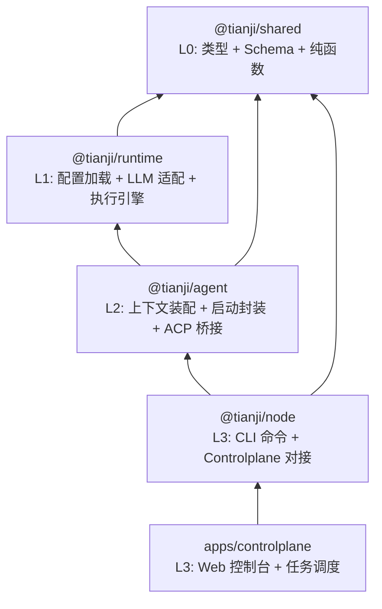
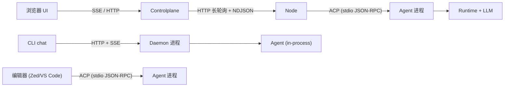
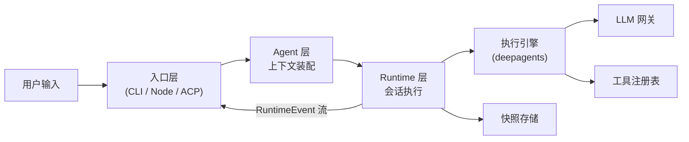
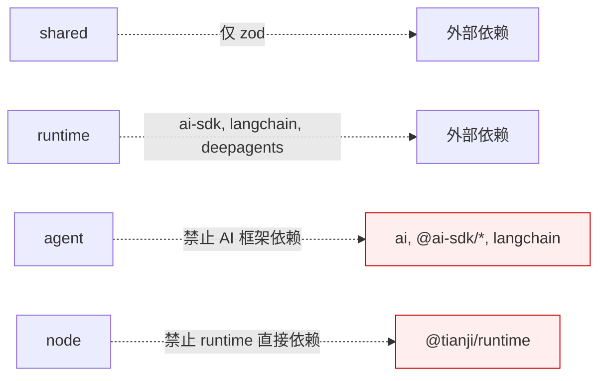

# Tianji AI 架构设计文档

> 状态：当前
> 日期：2026-04-04
> 相关文档：[`./CONFIG_DESIGN.md`](./CONFIG_DESIGN.md)、[`./RUNTIME_DESIGN.md`](./RUNTIME_DESIGN.md)、[`./OBSERVER_DESIGN.md`](./OBSERVER_DESIGN.md)、[`./AGENT_DESIGN.md`](./AGENT_DESIGN.md)、[`./CLI_GUIDE.md`](./CLI_GUIDE.md)、[`./DEVELOPMENT.md`](./DEVELOPMENT.md)

---

## 1. 分层架构

仓库采用 4 层分层结构，依赖方向严格自上而下：

| 层 | 包 | 核心职责 |
|----|----|---------|
| L0 | `@tianji/shared` | 公共类型、配置 Schema、纯函数、通用工具 |
| L1 | `@tianji/runtime` | 配置加载、LLM 网关、会话引擎、事件流、快照 |
| L2 | `@tianji/agent` | Agent 上下文装配、Session 封装、ACP 协议桥接 |
| L3 | `@tianji/node` | CLI 命令路由、Daemon 管理、Controlplane 连接 |
| L3 | `apps/controlplane` | Web UI、任务管理、Node 调度 |

---

## 2. 部署拓扑

三条接入路径共享同一个 Agent/Runtime 内核：

| 路径 | 通信方式 | 场景 |
|------|---------|------|
| Controlplane -> Node -> Agent | HTTP + ACP stdio | Web 控制台远程任务 |
| CLI -> Daemon -> Agent | HTTP + SSE | 本地命令行对话 |
| 编辑器 -> Agent | ACP stdio | IDE 集成 |

---

## 3. 数据流转

1. 入口层接收用户输入，转发到 Agent 层
2. Agent 层加载配置、Agent 定义和 SOUL.md，组装运行上下文
3. Runtime 层创建会话、调度引擎执行 turn
4. 引擎在每个 turn 内交替调用 LLM 和工具，持续产出 `RuntimeEvent`
5. 事件流回传到入口层，按场景渲染（终端、SSE、ACP 通知）

---

## 4. 依赖约束

| 包 | 允许的内部依赖 | 禁止依赖 |
|----|--------------|---------|
| `shared` | 无 | 所有内部包、AI 框架 |
| `runtime` | `shared` | `agent`、`apps/*` |
| `agent` | `shared`、`runtime` | AI 框架、Provider SDK、`apps/*` |
| `node` | `shared`、`agent` | `runtime`、AI 框架、Provider SDK |

核心原则：AI 框架依赖收敛在 runtime 内部，不外泄到上层。

---

## 5. 关键设计决策

| 决策 | 理由 | 权衡 |
|------|------|------|
| 协议层合并到 shared | 减少跨包引用，统一导入模型 | 基础层包体积略增 |
| LLM 能力收敛到 runtime | 不作为独立边界暴露，减少发布负担 | 未来若需独立消费 LLM 再拆分 |
| 引入 agent 装配层 | CLI/Web/Bot 共享上下文组装逻辑 | 多一层抽象，但职责清晰 |

---

## 6. 不变量

- **配置系统**：三层 JSON 配置 (`default < user < workspace`)，`${env:VAR_NAME}` 占位符。详见 [CONFIG_DESIGN.md](./CONFIG_DESIGN.md)
- **协议语义**：`RuntimeEvent`、Delta、Snapshot、错误模型
- **执行引擎**：deepagents
- **工具链**：pnpm workspace、Turborepo、Biome、Vitest、TypeScript strict mode
- **设计原则**：公共契约独立于框架实现；类型系统是架构约束的一部分；内部包不得各自读取配置文件

---

## 7. 演进方向

Agent 层为以下能力预留扩展空间：

- 多 agent 路由与组合
- Agent 间通信协议
- 任务规划器
- ACP 协议增强（会话恢复、权限桥接、Model/Mode 切换）
- Daemon 到 ACP 的统一（消除重复通信协议）

这些扩展在 agent 内部演进，不影响 runtime 核心引擎和 CLI 接口。
