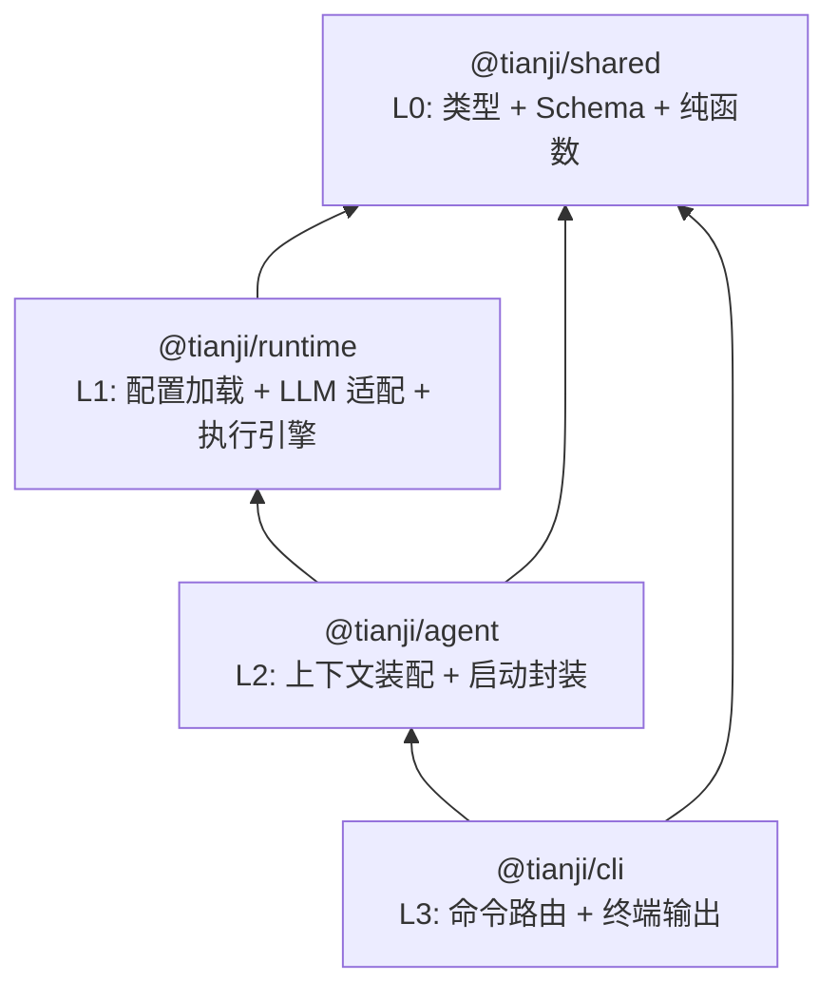
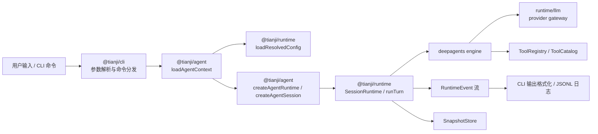

# Tianji AI 架构设计文档

> 状态：当前
> 日期：2026-04-03
> 相关文档：[`./CONFIG_DESIGN.md`](./CONFIG_DESIGN.md)、[`./RUNTIME_DESIGN.md`](./RUNTIME_DESIGN.md)、[`./OBSERVER_DESIGN.md`](./OBSERVER_DESIGN.md)、[`./AGENT_DESIGN.md`](./AGENT_DESIGN.md)、[`./CLI_GUIDE.md`](./CLI_GUIDE.md)、[`./DEVELOPMENT.md`](./DEVELOPMENT.md)

> 更新：2026-04-03，移除历史动机叙述，补充当前架构图与对话数据流转图。

---

## 1. 包结构

```text
tianji-ai/
├─ packages/
│  ├─ shared/       # L0: 类型、配置 schema、纯函数与通用工具
│  ├─ runtime/      # L1: 配置加载、LLM 适配、会话执行引擎
│  └─ agent/        # L2: 上下文装配、runtime 启动封装、编排扩展点
├─ apps/
│  └─ cli/          # L3: 终端 UI、命令分发、日志与输出格式化
```

当前仓库采用 4 层分层结构：`shared -> runtime -> agent -> cli`。

- `shared` 提供稳定的基础协议、配置 schema 和纯函数。
- `runtime` 负责配置解析、模型适配、执行引擎和事件流。
- `agent` 负责把最终配置装配为可执行的会话上下文，并为不同入口复用。
- `cli` 只负责终端交互，不直接承担底层运行时组装职责。

---

## 2. 架构图



分层说明：

- `@tianji/shared` 不依赖其他内部包。
- `@tianji/runtime` 依赖 `@tianji/shared`，集中处理运行期能力。
- `@tianji/agent` 依赖 `@tianji/shared` 和 `@tianji/runtime`，承担装配层职责。
- `@tianji/cli` 依赖 `@tianji/agent` 和 `@tianji/shared`，避免直接依赖 runtime 细节。

---

## 3. 对话数据流转图



流转说明：

1. CLI 接收用户输入，完成参数解析、命令路由和 i18n 初始化。
2. Agent 层加载最终配置、默认 agent、`SOUL.md` 和 provider 上下文。
3. Runtime 层完成配置解析、会话创建、事件流和快照存储。
4. 执行引擎在一次 turn 内调度模型调用与工具调用，并持续产出 `RuntimeEvent`。
5. CLI 消费事件流，把结果渲染到终端，并按需写入日志与快照。

---

## 4. 各包职责详述

### 4.1 `@tianji/shared` — L0 基础层

**职责**：

- 公共领域协议：`SessionId`, `ThreadId`, `RunId`, `AppMessage`, `RuntimeEvent`, `ToolSpec`, errors, deltas, snapshots, artifacts, policy
- 配置 Zod schema：`TianjiConfig`, providers, agents, runtime, observer
- 占位符解析：`${env:VAR_NAME}` 语法
- 配置纯函数：`mergeTianjiConfigLayers` 等不触及文件系统的配置变换逻辑
- 默认配置常量
- Agent 辅助函数：`parseAgentModelRef`, `getDefaultAgentDefinition`, `getAgentSoulPath`, `loadAgentSoul`
- 通用工具：`deepClone`, `sleep`, `retry`
- Delta 聚合器：`applyMessageDelta`, `isComplete`

**依赖约束**：

| 允许的外部依赖 | 允许的内部依赖 | 禁止依赖 |
|--------------|--------------|---------|
| `zod` | 无 | 所有内部包, `ai`, `@ai-sdk/*`, `@langchain/*`, `deepagents` |

**设计说明**：`shared` 只承载纯类型、schema 与纯函数，不负责配置文件路径解析、文件读取或运行期错误包装。这些运行期能力保持在 runtime，避免基础层演变成 I/O 与协议混合层。

### 4.2 `@tianji/runtime` — L1 执行层

**职责**：

- **LLM 网关**：`LlmGateway`, `LlmStream`, provider 工厂, 消息转换, tool schema bridge, usage 收集
- **中心化配置加载器**：`loadResolvedConfig`, `resolveConfigPaths`, `RuntimeConfigError`
- **会话运行时**：`createSessionRuntime`, `SessionRuntime`
- **事件流**：`ReplayableEventStream`
- **快照存储**：`SnapshotStore`, `FileSnapshotStore`, `InMemorySnapshotStore`
- **工具注册与策略**：`ToolRegistry`, `ToolCatalog`, `ensureToolAllowed`
- **执行引擎**：`deepagents-engine`
- **模型适配收敛点**：provider-specific 模型构造逻辑统一收敛到 `src/llm/` 内部模块

**依赖约束**：

| 允许的外部依赖 | 允许的内部依赖 | 禁止依赖 |
|--------------|--------------|---------|
| `ai`, `@ai-sdk/*`, `@langchain/*`, `langchain`, `deepagents`, `zod` | `@tianji/shared` | `@tianji/agent`, `apps/*` |

**公共 API 变化约束**：

- 不公开导出 `LlmGateway`, `LlmStream`, `LlmProvider` 等 LLM 层接口类型
- 继续导出 `createSessionRuntime`, `SessionRuntime`, `ResolvedConfig`, `loadResolvedConfig`
- 继续导出 `SnapshotStore`, `ToolRegistry`, `ReplayableEventStream`
- `LlmGenerationConfig` 若继续被 `RunTurnOptions` 使用，归属必须保持明确，不能依赖已删除边界

**内部模块组织**：

```text
packages/runtime/src/
├─ index.ts
├─ config.ts
├─ runtime.ts
├─ event-stream.ts
├─ snapshot-store.ts
├─ tool-catalog.ts
├─ engines/
│  └─ deepagents-engine.ts
└─ llm/
   ├─ index.ts
   ├─ factory.ts
   ├─ sdk-gateway.ts
   ├─ openai-gateway.ts
   ├─ anthropic-gateway.ts
   ├─ google-gateway.ts
   ├─ message-conversion.ts
   ├─ tool-schema-bridge.ts
   └─ usage.ts
```

### 4.3 `@tianji/agent` — L2 编排层

**职责**：

- **配置上下文组装**：把 runtime 的 `ResolvedConfig` 转化为可执行的 agent 上下文
- **runtime 启动封装**：封装从上下文创建 `SessionRuntime`、`Session`、`runTurn` 输入的流程
- **高层 chat API**：按需提供更简洁的会话封装，但不替代底层启动原语
- **Provider 环境注入**：保留兼容当前 provider SDK 行为的过渡桥接
- **首次运行初始化**：`ensureDefaultUserConfig`
- **扩展点**：多 agent 路由、agent 间通信、规划器

**关键接口设计**：

```typescript
export interface AgentContext {
  readonly agentName: string
  readonly modelRef: string
  readonly provider: string
  readonly modelName: string
  readonly providerConfig: TianjiProviderConfig | undefined
  readonly soulPath: string
  readonly soul: string
}

export interface LoadedAgentContext {
  readonly paths: AgentAppPaths
  readonly config: TianjiConfig
  readonly agent: AgentContext
  readonly resolvedEnvVars: readonly string[]
  readonly snapshotStore: SnapshotStore
}

export interface AgentAppPaths {
  readonly configDir: string
  readonly agentsDir: string
  readonly logsDir: string
  readonly configFilePath: string
  readonly cliLogFilePath?: string
}

export function loadAgentContext(
  options?: LoadAgentContextOptions,
): Promise<LoadedAgentContext>

export function createAgentRuntime(
  context: LoadedAgentContext,
): SessionRuntime

export function createAgentSession(
  context: LoadedAgentContext,
): AgentSession

export interface AgentSession {
  readonly chat: (
    prompt: string,
    options?: ChatOptions,
  ) => AsyncIterable<RuntimeEvent>
  readonly sessionId: SessionId
}
```

**依赖约束**：

| 允许的外部依赖 | 允许的内部依赖 | 禁止依赖 |
|--------------|--------------|---------|
| `zod`（可选） | `@tianji/shared`, `@tianji/runtime` | `ai`, `@ai-sdk/*`, `@langchain/*`, Provider SDK, `apps/*` |

**设计说明**：`agent` 的核心职责是把最终配置映射为可执行 runtime 输入。CLI、Web、Bot 等入口可以共享装配逻辑，但按各自入口决定如何消费 `RuntimeEvent`。

### 4.4 `@tianji/cli` — L3 UI 层

**职责**：

- CLI 参数解析：`parseCliArgs`
- 声明式命令注册与帮助生成：`commands/registry.ts`, `commands/help.ts`
- `tianji run` / `tianji log` / `tianji daemon` / `tianji chat` 命令路由
- CLI i18n 初始化与用户可见文案翻译：`i18n/`
- 终端输出格式化：event -> stdout
- CLI 日志系统：`CliLogger`, JSONL 日志

**依赖约束**：

| 允许的外部依赖 | 允许的内部依赖 | 禁止依赖 |
|--------------|--------------|---------|
| `@types/node` | `@tianji/agent`, `@tianji/shared` | `@tianji/runtime`, `ai`, `@ai-sdk/*`, `@langchain/*`, Provider SDK |

**边界要求**：

- CLI 不再承担配置组装逻辑
- CLI 不直接创建 runtime
- CLI 可以继续从 `shared` 获取 `RuntimeEvent`、`AppMessage` 等协议类型
- CLI 入口收口为开发环境初始化、全局 flag 拦截、i18n 初始化、帮助/版本输出、命令分发和统一错误出口

---

## 5. 依赖矩阵与强制约束

| 包 | 允许的内部依赖 | 允许的外部依赖 | 禁止依赖 |
|----|--------------|--------------|---------|
| `@tianji/shared` | 无 | `zod` | 所有内部包, `ai`, `@ai-sdk/*`, `@langchain/*`, `deepagents` |
| `@tianji/runtime` | `@tianji/shared` | `ai`, `@ai-sdk/*`, `@langchain/*`, `langchain`, `deepagents`, `zod` | `@tianji/agent`, `apps/*` |
| `@tianji/agent` | `@tianji/shared`, `@tianji/runtime` | `zod`（可选） | `ai`, `@ai-sdk/*`, `@langchain/*`, Provider SDK, `apps/*` |
| `@tianji/cli` | `@tianji/agent`, `@tianji/shared` | `@types/node` | `@tianji/runtime`, `ai`, `@ai-sdk/*`, `@langchain/*`, Provider SDK |

**实施手段**：

- `package.json#exports` 限制 deep import
- CI lint 检查禁止违规依赖
- 对 `@tianji/shared` 持续执行零内部包依赖检查
- 对 `@tianji/agent` 和 `@tianji/cli` 执行禁止直接使用框架依赖检查

**补充约束**：CLI 如果需要消费 `RuntimeEvent`、`AppMessage` 等协议类型，应从 `shared` 获取，或由 `agent` 统一再导出；但 CLI 不应直接 import runtime 创建或配置装配原语。

---

## 6. 文件级映射

### 6.1 协议与基础能力归并到 `shared`

| 文件 | 目标位置 | 说明 |
|------|---------|------|
| `packages/contracts/src/identifiers.ts` | `packages/shared/src/identifiers.ts` | 协议类型 |
| `packages/contracts/src/errors.ts` | `packages/shared/src/errors.ts` | 错误模型 |
| `packages/contracts/src/events.ts` | `packages/shared/src/events.ts` | 事件协议 |
| `packages/contracts/src/message.ts` | `packages/shared/src/message.ts` | 消息协议 |
| `packages/contracts/src/tool.ts` | `packages/shared/src/tool.ts` | 工具协议 |
| `packages/contracts/src/policy.ts` | `packages/shared/src/policy.ts` | 策略定义 |
| `packages/contracts/src/delta.ts` | `packages/shared/src/delta.ts` | Delta 协议 |
| `packages/contracts/src/delta-aggregator.ts` | `packages/shared/src/delta-aggregator.ts` | Delta 聚合 |
| `packages/contracts/src/artifact.ts` | `packages/shared/src/artifact.ts` | Artifact 协议 |
| `packages/contracts/src/snapshot.ts` | `packages/shared/src/snapshot.ts` | Snapshot 协议 |
| `packages/contracts/src/index.ts` | `packages/shared/src/index.ts` | 统一导出 |

### 6.2 LLM 能力内聚到 `runtime`

| 文件 | 目标位置 | 说明 |
|------|---------|------|
| `packages/llm/src/factory.ts` | `packages/runtime/src/llm/factory.ts` | provider 工厂 |
| `packages/llm/src/sdk-gateway.ts` | `packages/runtime/src/llm/sdk-gateway.ts` | SDK gateway |
| `packages/llm/src/openai-gateway.ts` | `packages/runtime/src/llm/openai-gateway.ts` | OpenAI 适配 |
| `packages/llm/src/anthropic-gateway.ts` | `packages/runtime/src/llm/anthropic-gateway.ts` | Anthropic 适配 |
| `packages/llm/src/google-gateway.ts` | `packages/runtime/src/llm/google-gateway.ts` | Google 适配 |
| `packages/llm/src/message-conversion.ts` | `packages/runtime/src/llm/message-conversion.ts` | 消息转换 |
| `packages/llm/src/tool-schema-bridge.ts` | `packages/runtime/src/llm/tool-schema-bridge.ts` | 工具 schema 桥接 |
| `packages/llm/src/usage.ts` | `packages/runtime/src/llm/usage.ts` | usage 收集 |
| `packages/llm/src/index.ts` | `packages/runtime/src/llm/index.ts` | 内部 barrel |

### 6.3 CLI 装配逻辑收敛到 `agent`

| 位置 | 目标位置 | 说明 |
|------|---------|------|
| `apps/cli/src/config.ts` 中的配置上下文装配与 provider 注入逻辑 | `packages/agent/src/context.ts` | 提取为可复用上下文层 |
| `apps/cli/src/main.ts` 中的 runtime 创建与 runTurn 启动逻辑 | `packages/agent/src/session.ts` | 提取为统一启动原语 |

### 6.4 保持原位的核心文件

- `packages/shared/src/config.ts`
- `packages/shared/src/utils.ts`
- `packages/runtime/src/runtime.ts`
- `packages/runtime/src/config.ts`
- `packages/runtime/src/engines/deepagents-engine.ts`
- `packages/runtime/src/event-stream.ts`
- `packages/runtime/src/snapshot-store.ts`
- `packages/runtime/src/tool-catalog.ts`
- `apps/cli/src/logger.ts`
- `apps/cli/src/log-follow.ts`
- `apps/cli/src/bin.ts`

### 6.5 测试与文档同步要求

- `packages/runtime/src/__tests__/index.test.ts` 的依赖边界断言必须与当前包结构保持一致
- `apps/cli/src/__tests__/config.test.ts`、`inject-provider-env.test.ts` 中与配置装配相关的测试应迁移到 `packages/agent`
- `apps/cli/src/__tests__/run-e2e.test.ts` 中对旧启动原语的测试应改为 `createAgentRuntime` 或更高层 agent session API
- 根目录 `README.md`、`packages/runtime/README.md`、`apps/cli/README.md` 需要同步反映当前架构边界

---

## 7. 关键设计决策与权衡

### 7.1 协议层合并到 `shared`

- 类型定义、schema 和配置纯函数统一放在同一基础层，减少跨包引用与重复维护
- `shared` 允许依赖 `zod`，但纯类型导出不会产生额外运行时代码
- 若未来需要更极致的 tree-shake，可通过 subpath exports 进一步拆分 `types` 与 `config`

**权衡**：基础层包体积略增，但换来更直接的导入模型和更清晰的边界。

### 7.2 LLM 能力收敛到 `runtime`

- AI SDK 与 provider gateway 属于 runtime 内部实现，不作为独立架构边界对外暴露
- provider-specific 模型适配逻辑统一进入 `runtime/src/llm/`
- runtime 直接依赖内部 LLM 模块，减少额外包边界和发布负担

**权衡**：如果未来确实出现 runtime 之外的 LLM 直接消费者，再评估是否重新抽边界；当前没有这类需求。

### 7.3 引入 `agent` 作为装配层

- 配置加载后的 agent 选择、`SOUL.md` 读取、provider 上下文组装不属于 UI 层，也不应散落在多个入口中
- `agent` 为 CLI、Web、Bot 等不同入口提供统一的 runtime 启动方式
- 多 agent 路由、通信和规划能力在这里继续扩展，不污染 runtime 核心执行层

**权衡**：新增一层抽象，但这层的职责清晰且稳定，能明显降低入口层重复实现。

---

## 8. 保持不变的设计

- **配置系统**：三层 JSON 配置 (`default < user < workspace`)，`${env:VAR_NAME}` 占位符，由 runtime 中心化加载；shared 仅提供 schema、placeholder 与 merge 纯函数。详见 [`CONFIG_DESIGN.md`](./CONFIG_DESIGN.md)
- **协议语义**：`RuntimeEvent` 类型、Delta 语义、Snapshot 结构、错误模型
- **执行引擎**：deepagents 作为当前唯一编排引擎
- **配置 Schema**：`TianjiConfig` 的 providers / agents / runtime / observer 四个顶层块
- **工具链**：pnpm workspace, Turborepo, Biome, Vitest, TypeScript strict mode
- **设计原则**：
  - LangChain / LangGraph 只在 runtime 内部使用，不外泄类型
  - 公共契约独立于框架实现
  - 类型系统是架构约束的一部分
  - 内部包不得各自独立读取配置文件或环境变量

---

## 9. 对 CONFIG_DESIGN.md 的影响

- 运行时加载流水线中，默认 agent 定义与 `SOUL.md` 的解析由 `agent` 层承担
- schema 校验、placeholder 解析、merge 语义仍由 `shared` 提供纯函数
- 文件系统级加载与错误包装仍由 `runtime` 负责
- 其余配置语义保持不变

---

## 10. 未来演进方向

`agent` 包为以下能力提供独立扩展空间：

- **多 agent 路由**：基于 prompt 意图选择不同 agent 配置
- **agent 间通信**：多 agent 协作时的消息传递协议
- **规划器**：复杂任务的分步规划与执行
- **agent 组合**：将多个 agent 组合为工作流
- **tools-node 集成**：工具集由 agent 层配置并注入 runtime

这些扩展将在 `agent` 内部演进，不影响 runtime 的核心执行引擎，也不影响 CLI 等 UI 层接口。

---

## 11. 总结

当前架构的核心原则是：

- `shared` 提供稳定基础协议与配置纯函数
- `runtime` 封装配置加载、模型适配和执行引擎
- `agent` 负责上下文装配与启动封装
- `cli` 专注终端交互、命令调度和输出呈现

整体目标不是增加抽象层数，而是让每一层只承担自己的职责，并为后续多入口和多 agent 扩展保留清晰边界。
