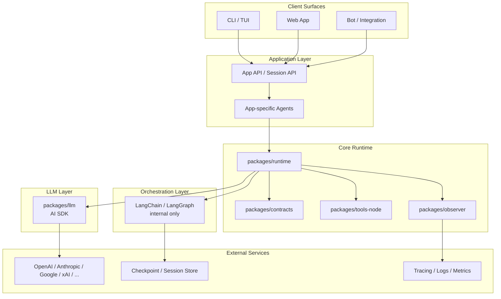
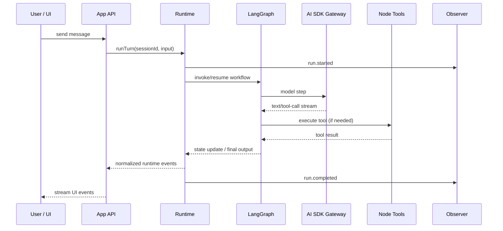

# Tianji AI 架构设计文档 v1

> 状态：Draft v1  
> 日期：2026-03-09  
> 来源项目：`/workspaces/dev_docker/pi-mono`  
> 目标：将 `pi-mono` 重构为新的 `tianji-ai` 项目，采用 **AI SDK** 作为 LLM 接入层与 Agent 基础抽象，采用 **LangChain / LangGraph** 作为 Agent 编排层。

---

## 1. 背景与目标

`pi-mono` 当前已经具备比较清晰的分层：

- `packages/ai`：统一多 Provider LLM 接口
- `packages/agent`：Agent 运行时与工具调用循环
- `packages/coding-agent`：面向编码场景的应用层 Agent
- `packages/observer`：日志与 tracing
- `packages/web-ui` / `packages/tui` / `packages/mom`：多种交互入口

这说明原项目的核心问题不是“有没有分层”，而是：

1. LLM 接入层与 Agent Loop 主要是自研实现，后续维护成本高；
2. 新项目需要站在更主流的生态之上，降低 Provider 适配、流式输出、工具调用、多工作流编排的实现负担；
3. 需要避免在 `AI SDK` 与 `LangChain` 之间重复建设两套模型、消息、工具、记忆和循环抽象。

### 1.1 v1 目标

v1 不是一次性重写所有能力，而是先建立一个 **可以承接旧能力迁移、并能支持新 Agent 应用继续演进** 的基础架构。

v1 的目标是：

- 以 **AI SDK** 统一 Provider、Model、Streaming、Tool Calling 的接入；
- 以 **LangChain / LangGraph** 统一多步骤 Agent 编排、状态推进和工作流控制；
- 保留 `pi-mono` 中已经验证过的边界：**LLM 层 / Runtime 层 / 工具层 / 观测层 / 应用入口层**；
- 明确 server-only 与 client-only 的边界，避免浏览器直接承载 LLM Provider 访问与敏感工具执行；
- 支持后续迁移 CLI、Web、Bot 等不同交互入口。

### 1.2 非目标

以下内容 **不纳入 v1**：

- 不重建 `pi-mono` 中完整的扩展系统 / skill 系统 / 插件市场；
- 不暴露 LangChain 的内部类型（如 `BaseMessage`、Graph State、Agent Executor）作为项目公共协议；
- 不在浏览器端直接访问 Provider，也不支持浏览器侧保存 Provider 密钥；
- 不一开始就做复杂的多租户模型注册中心、插件化 Provider 市场、泛化 RPC 网关；
- 不先做多应用形态的全量迁移，优先固化 runtime 契约与编排基础设施。

### 1.3 基础技术选型

v1 明确采用以下基础技术栈：

- **TypeScript**：作为项目主语言，用于 apps 与 packages 的统一开发
- **严格类型检查**：默认启用严格类型检查，保证 contracts、runtime、tool schema 与配置 schema 的边界可验证
- **pnpm monorepo**：作为 workspace 与依赖管理方式
- **Turborepo**：作为 monorepo 的构建、测试、typecheck、lint 编排层
- **Biome**：作为前端代码质量工具链，统一承担格式化、lint、import organization 与统一 check 工作流等职责
- **Vitest**：作为单元测试与轻量集成测试框架

这组技术选型的主要目标是：

- 让多 package 的公共协议在编译期可验证
- 让 build / test / typecheck / lint / format 在 monorepo 中具备稳定且可缓存的执行路径
- 让前端与通用 TypeScript 代码拥有一致、快速、低配置的代码质量检查链路
- 让 `contracts` / `runtime` / `tools` 这些核心逻辑具备低成本、高反馈的测试能力

---

## 2. 关键设计原则

### 原则 A：AI SDK 负责“接模型”，LangChain 负责“编排流程”

这是本次重构最重要的原则。

**AI SDK 负责：**

- Provider 适配
- Model 选择
- Streaming 输出
- Tool Calling 协议
- UI / Runtime 的消息流桥接

**LangChain / LangGraph 负责：**

- 多步骤 Agent 工作流
- 状态机与节点编排
- Checkpoint / Thread State
- 多 Agent 协作与路由
- 复杂控制流（planner / executor / reviewer / handoff）

### 原则 B：系统里只能有一个“主循环”

不能同时让 AI SDK Agent Loop 与 LangChain Agent Loop 都成为系统主循环，否则会出现：

- 双重工具调用控制
- 双重消息状态
- 双重 memory / checkpoint
- 调试困难
- 事件流与 UI 更新难以统一

因此在 v1 中：

- **LangChain / LangGraph 是唯一的编排主循环；**
- **AI SDK 是底层模型与工具调用协议层；**
- 需要简单单轮或轻量 agentic 调用时，仍然走统一 runtime 出口，不允许应用层绕过 runtime 私自组装循环。

### 原则 C：公共契约独立于框架实现

项目中的公共协议（会话事件、消息片段、工具结果、工件、错误模型）不能直接依赖 AI SDK 或 LangChain 的内部类型。

否则将来替换编排实现、调整 UI、增加新的 runtime 入口时，会出现强耦合。

### 原则 D：保留 `pi-mono` 已经验证过的边界

从 `pi-mono` 现状看，以下边界是值得继承的：

- LLM 接入层独立
- Runtime / Agent Session 独立
- Node 工具集独立
- Observer / Telemetry 独立
- CLI / Web / Bot 作为应用入口层独立

重构的重点应是“替换内部实现”，而不是“打平全部模块”。

### 原则 E：类型系统是架构约束的一部分

`tianji-ai` 的很多关键边界——例如 `contracts`、`ExecutionPolicy`、`ToolSpec`、`ResolvedConfig`、runtime event——都不应该只停留在文档层，而应该尽量转化成编译期可验证的约束。

因此 v1 默认采用：

- TypeScript 作为主语言
- 严格类型检查作为默认工程基线
- 尽量避免“运行时才发现契约不匹配”的宽松约定

---

## 3. 目标架构总览



### 核心判断

新项目仍建议采用 **pnpm monorepo**，并使用 **Turborepo** 管理 build / test / typecheck / lint / format 的编排与缓存，其中前端代码质量检查默认由 **Biome** 承担。但不要照搬 `pi-mono` 的全部 package 数量。v1 应优先收敛为少量核心包，再在后续版本按复杂度拆分。

---

## 4. 建议的代码组织（v1）

建议采用如下结构：

```text
tianji-ai/
├─ tianji.config.json          # 项目层默认配置
├─ package.json
├─ biome.json                  # Biome 统一配置（Lint / Format / Imports）
├─ pnpm-workspace.yaml
├─ turbo.json
├─ apps/
│  ├─ cli/                    # 可选，后续迁移 TUI / CLI
│  ├─ web/                    # 可选，后续迁移 Web UI
│  └─ bot/                    # 可选，后续迁移 Slack / IM Bot
├─ packages/
│  ├─ contracts/              # 公共领域协议，不依赖 AI SDK / LangChain
│  ├─ llm/                    # AI SDK 封装：provider、model、stream、tool bridge
│  ├─ runtime/                # Session Runtime，内含 LangGraph 编排
│  ├─ tools-node/             # 文件、Shell、Git、搜索等 Node-only 工具
│  ├─ observer/               # tracing / logging / metrics / cost
│  └─ shared/                 # 通用 utils / config schema / env helpers
├─ docs/
│  ├─ ARCHITECTURE_V1.md
│  └─ CONFIG_DESIGN.md
```

### 4.0 配置系统概览

v1 采用**三层 JSON 配置 + env 敏感值注入**模型：

- 项目层：`<project-root>/tianji.config.json`
- 用户层：`~/.config/tianji-ai/tianji.json`
- workspace 层：`~/.config/tianji-ai/workspaces/<workspace-id>.json`

覆盖顺序为：

> **项目层 < 用户层 < workspace 层**

环境变量不作为第四层配置，而是只承担 **secret 注入** 与少量 **bootstrap** 角色。  
详细设计见：[`./CONFIG_DESIGN.md`](./CONFIG_DESIGN.md)

### 4.1 `packages/contracts`

职责：定义项目公共协议。

建议包含：

- `SessionId`, `ThreadId`, `RunId`
- `AppMessage`, `MessagePart`, `ToolInvocation`, `ToolResult`
- `RuntimeEvent`（如 `run.started`, `message.started`, `message.delta`, `tool.started`, `tool.completed`, `run.completed`, `run.failed`, `run.cancelled`）
- `Artifact`（代码片段、文件变更、图像、结构化结果）
- `MessageDelta`, `ToolProgressDelta`, `ArtifactDelta`
- `RuntimeError`, `ToolError`, `ProviderError`, `PolicyError`, `TimeoutError`, `CancelledError`
- `AgentContext` / `ExecutionPolicy`

要求：

- **不得依赖** `ai`, `langchain`, `@langchain/*`；
- 用项目自己的领域语言表达，而不是框架术语；
- 作为 CLI / Web / Bot / Runtime 的唯一共享协议来源。

#### Contracts v1 必须冻结的流式语义

`contracts` 在 v1 就必须把增量协议定义清楚，否则 CLI / Web / Bot 会各自发明一套拼接逻辑。

建议把以下类型作为一等公民：

- `MessageDelta`：文本/思考/结构化消息的增量片段
- `ToolProgressDelta`：工具执行中的阶段更新、stdout/stderr tail、部分结果
- `ArtifactDelta`：工件生成过程中的增量更新

这些增量类型至少需要统一以下字段：

- `runId`, `messageId`, `toolCallId`, `artifactId`（按需）
- `sequence`：全局或局部单调递增序号，用于排序与去重
- `op`：`append` / `replace` / `complete`
- `channel`：如 `text`, `thinking`, `tool-args`, `tool-output`, `artifact`
- `payload`
- `timestamp`

同时需要定义聚合规则：

- `MessageDelta` 如何聚合为最终 `AppMessage`
- `ToolProgressDelta` 如何聚合为最终 `ToolResult`
- `ArtifactDelta` 如何聚合为最终 `Artifact`
- `run.cancelled` / `run.failed` 到达时，哪些增量可视为终态，哪些必须丢弃

#### Delta 聚合逻辑的归属

增量聚合逻辑不能散落在各个 UI 入口中。v1 明确约定：

- `contracts` 定义 delta 类型与聚合语义；
- `contracts` 同时提供一个**纯函数 / 无 IO** 的 `DeltaAggregator` 参考实现；
- CLI / Web / Bot 使用同一套 `DeltaAggregator` 进行流式拼接；
- runtime 内部也使用同一个 `DeltaAggregator` 生成最终状态并落盘。
- 对外可见的**持久化最终状态真相**仍然由 runtime 持有，而不是由任意 UI 侧聚合结果决定。

这样可以同时满足两件事：

- 保留流式体验，runtime 仍然持续推送 delta；
- 聚合逻辑只写一次，避免不同入口各自实现一套拼接器。

#### ExecutionPolicy v1 字段分层

`ExecutionPolicy` 不能只是一个抽象名词，但也要避免“纸面完备、运行时没实现”。因此 v1 建议分成两层：

**v1 core fields**：这些字段要求在单 Agent / 单工作流里就有真实执行路径。

- `retry.maxAttempts`
- `retry.baseDelayMs`
- `retry.maxDelayMs`
- `tool.timeoutMs`
- `tool.maxConcurrency`
- `tool.allowDestructive`
- `tool.pathPolicy.forbidDirectories`
- `tool.pathPolicy.filenameDenyPatterns`

**v1 reserved / experimental fields**：类型先冻结，但在 v1 不承诺所有字段都有完整运行时行为。

- `fallback.enabled`
- `fallback.allowedProviders`
- `fallback.allowedModels`
- `fallback.afterSideEffectPolicy`（例如 `forbid` / `require-explicit-graph-branch`）
- `cancellation.mode`（graceful / force）
- `humanApproval.requiredToolTags`

对 reserved / experimental 字段，runtime 必须显式声明支持状态；不允许静默忽略已配置字段。

其中 `tool.pathPolicy` 在当前版本先聚焦两类能力：

- **forbid 目录权限**：命中目录前缀即拒绝执行
- **文件名正则权限控制**：按 basename 或相对路径做 deny 正则匹配

建议默认策略：

- 默认 allow，只有命中 deny 才拒绝
- 目录 deny 与文件名 deny 同时命中时，以更严格规则为准
- 所有拒绝都返回结构化 `PolicyError`

### 4.2 `packages/llm`

职责：用 **AI SDK** 替代原 `pi-ai`，成为唯一的 LLM 接入层。

建议包含：

- Provider 工厂与配置加载
- Model 路由与默认模型策略
- 统一的消息转换：`AppMessage -> AI SDK ModelMessage`
- AI SDK Streaming 事件标准化
- Tool Schema 注册与桥接
- Token / cost / usage 收集接口
- Provider fallback / retry / timeout 策略

要求：

- 对外暴露项目自己的 `LlmGateway` / `LlmStream` 接口；
- 不让上层直接依赖具体 Provider SDK；
- 保留 `pi-mono` 中“消息先转换再送模型”的边界思想；
- 对外只暴露必要的 AI SDK 能力，不透出过多底层细节。
- `@ai-sdk/langchain` 仅作为**可选适配器**，不是架构前提；
- 即使不使用 `@ai-sdk/langchain`，`runtime` 也必须能够通过项目自定义 adapter 直接消费 `llm` 层输出。

#### 关于 `@ai-sdk/langchain` 的定位

根据当前官方文档和源码线索，`@ai-sdk/langchain` 已经提供：

- `toBaseMessages`
- `toUIMessageStream`
- 对 `streamEvents()` 的适配
- `onAbort` / `onError` 等回调钩子

但 v1 不能把它视为“必然可靠且无损”的核心依赖。原因是：

- 适配层仍存在版本演进与行为变化风险；
- tool call / result / interrupt 的语义最终仍由上层工作流决定；
- 一旦桥接层在流式粒度、tool event 对齐、abort 传播上出现 gap，runtime 需要有自己的 fallback adapter。

因此：

- **架构上依赖 AI SDK 与 LangGraph 的职责边界，不依赖某一个桥接包必须完美可用；**
- **实现上在 Phase 1 明确验证桥接能力边界，不通过则落到 runtime 自定义 adapter。**

### 4.3 `packages/runtime`

职责：作为系统运行时核心，承接原 `pi-agent-core` + `coding-agent/core` 中可复用的 session 逻辑。

建议包含：

- Session 生命周期管理
- 运行上下文与执行策略
- 历史消息装配与上下文压缩
- 工具执行协调
- 重试 / 熔断 / 降级
- Runtime Event 发射
- LangGraph 工作流编排实现
- SessionSnapshot / RunSnapshot 抽象
- Agent profile（coding / research / general assistant）

关键要求：

- **LangChain / LangGraph 只在此包内部使用，不外泄类型；**
- runtime 对外暴露 `createSession()` / `runTurn()` / `resumeRun()` / `streamEvents()` 等稳定 API；
- 应用层只消费项目事件流，不直接操作 LangGraph 节点；
- 轻量单 Agent 与复杂多 Agent 在外部都表现为一致的 Runtime API；
- `runTurn()` / `resumeRun()` 必须接受取消句柄（如 `AbortSignal` 或等价 abstraction）；
- runtime 必须负责把取消传播到 graph、LLM streaming、tool execution、retry wait、snapshot persistence。

#### Runtime v1 必须拥有的 snapshot 边界

v1 不应把 LangGraph checkpointer 直接定义为系统公共真相，而应由 runtime 拥有自己的快照抽象：

- `SessionSnapshot`
- `RunSnapshot`
- `SnapshotStore`

LangGraph checkpointer 在 v1 中只是 `SnapshotStore` 的一个内部实现。这样做的目的：

- 避免把 LangGraph 的序列化格式变成项目永久持久化协议；
- 允许后续替换持久化实现或调整编排框架；
- 让 UI / API / 运维系统消费的是 runtime 语义，而不是图执行器语义。

### 4.4 `packages/tools-node`

职责：承接所有 Node-only 高权限工具。

包括但不限于：

- `read`, `write`, `edit`
- `bash`
- `grep`, `glob`
- `git`
- 项目级特定工具（构建、测试、索引、代码智能）

要求：

- 工具定义与执行权限统一管理；
- 支持 dry-run、审计日志、权限白名单；
- Web 客户端绝不能直接 import 该包；
- 工具返回值统一映射为 `contracts` 中的 `ToolResult`。

`tools-node` 不应直接把自己暴露给多套上层框架，而是统一由 `runtime` 内的 `ToolCatalog / ToolRegistry` 接管。

在当前版本中，`tools-node` 执行前必须统一经过路径权限检查，至少包括：

- **forbidDirectories**：禁止访问的目录列表，支持绝对路径和 workspace 相对路径
- **filenameDenyPatterns**：禁止访问的文件名 / 相对路径正则

建议先覆盖以下典型禁止目录：

- `.git/`
- `node_modules/`
- `.env*` 所在目录或敏感配置目录
- 系统临时目录之外的用户主目录敏感路径

建议权限判断顺序：

1. 路径标准化（resolve / normalize / 消除 `..`）
2. 对已存在路径执行 `realpath`，解析 symlink 目标
3. 同时对**逻辑路径**和**真实路径**执行 deny 检查
4. 命中 `forbidDirectories` 则直接拒绝
5. 命中 `filenameDenyPatterns` 则直接拒绝
6. 未命中任何 deny 规则，则允许执行
7. 记录审计日志并继续执行

补充约束：

- 仅靠 `normalize` 无法防住 symlink 绕过，必须检查 `realpath` 结果；
- v1 默认采用 **resolve-and-check** 策略，即允许跟随 symlink，但必须对目标路径再次做 deny 校验；
- 如后续需要更严格模式，可扩展 `followSymlinks` 策略开关，但 v1 先固定为上述默认行为。

### 4.5 `packages/observer`

职责：保留并继承 `pi-mono` 中已经相对成熟的观测边界。

建议跟踪：

- session
- turn
- model call
- tool call
- orchestration step
- token / latency / cost
- error taxonomy

要求：

- 与 runtime 松耦合；
- 支持结构化日志 + tracing；
- 后续可接 OTEL / Langfuse / 自建 metrics。

---

## 5. 旧架构到新架构的职责映射

| `pi-mono` 现有包 | 现有职责 | `tianji-ai` v1 对应 | 说明 |
|---|---|---|---|
| `packages/ai` | 多 Provider LLM API | `packages/llm` | 用 AI SDK 重写内部实现，保留统一接入层定位 |
| `packages/agent` | Agent runtime / tool loop | `packages/runtime` | 用 LangGraph 替代自研 loop，但外部 runtime API 保持稳定 |
| `packages/coding-agent` | 编码代理应用逻辑 | `apps/cli` + `packages/runtime` | 通用会话逻辑下沉到 runtime，场景逻辑保留在 app 层 |
| `packages/observer` | logging / tracing | `packages/observer` | 基本保留 |
| `packages/web-ui` | Web UI + AI 交互 | `apps/web` | 改为只消费 runtime 事件，不直接调 provider |
| `packages/mom` | Slack Bot | `apps/bot` | 复用 runtime API |
| `packages/tui` | 终端 UI | `apps/cli` 或单独保留 | 视后续是否需要沉淀为独立 UI 基础包 |
| `packages/pods` | vLLM 部署管理 | 暂不纳入 v1 核心 | 后续视需要再并入 infra tooling |

---

## 6. 运行时分层与边界

### 6.1 分层职责

#### L0：Contracts Layer

只定义协议，不做实现。

#### L1：LLM Access Layer（AI SDK）

负责与模型世界对接。

输入：项目消息、工具声明、运行参数  
输出：标准化流式事件、模型调用结果、Provider 级 usage 数据

#### L2：Runtime / Orchestration Layer（LangGraph 内聚于 Runtime）

负责“这一轮会话怎么推进”。

输入：用户消息、系统上下文、历史状态、工具能力  
输出：统一 runtime 事件流、工具执行请求、最终结果

#### L3：Application Layer

负责“这个 Agent 产品要做什么”。

例如：

- coding agent
- research agent
- customer support agent
- bot integration

#### L4：Interface Layer

CLI / Web / Bot / HTTP API 等交互入口。

### 6.2 边界约束

**Web 端不能：**

- 直接触达 Provider
- 直接持有 Node 工具
- 直接操作 LangGraph State

**App 层不能：**

- 直接 import Provider SDK
- 自己组装独立 agent loop

**Runtime 层不能：**

- 把 LangChain 的内部类型当作项目公共类型导出

#### 6.3 依赖矩阵与强制约束

除了文字约束，v1 还需要通过包结构和 CI 强制执行边界。

| 包/层 | 允许依赖 | 禁止依赖 |
|---|---|---|
| `packages/shared` | 外部 utility 库（如 zod、type-fest） | 所有内部包：`contracts`, `llm`, `runtime`, `tools-node`, `observer`, `apps/*` |
| `packages/contracts` | 无内部包依赖 | `shared`, `llm`, `runtime`, `tools-node`, `observer`, `@langchain/*`, `ai` |
| `packages/llm` | `contracts`, `shared`, AI SDK | `apps/*`, `tools-node`, `@langchain/*` |
| `packages/runtime` | `contracts`, `shared`, `llm`, `observer`, `tools-node`, `@langchain/*` | `apps/*` 对 runtime 反向依赖 |
| `packages/tools-node` | `contracts`, `shared` | `apps/*`, `web`, 浏览器专属包 |
| `apps/*` | `contracts`, `runtime` | `llm`, `tools-node`, `@langchain/*`, Provider SDK |

实施手段：

- 使用 `package.json#exports` 限制 deep import
- 在 monorepo lint / CI 中禁止 `apps/*` 直接 import `@langchain/*`、Provider SDK、`packages/tools-node`
- 对 `packages/shared` 开启“不得依赖任何内部包”检查
- 对 `packages/contracts` 开启“零内部依赖”检查
- 对 `packages/runtime` 以外的位置禁止自定义 agent loop

---

## 7. AI SDK 与 LangChain 的协作方式

### 7.1 推荐协作模型

#### AI SDK 负责的能力

- Provider / Model 统一入口
- 流式文本与结构化输出
- 工具声明的底层协议
- UIMessage / Message Stream 适配
- 可选地使用 `@ai-sdk/langchain` 做消息流桥接

#### LangChain / LangGraph 负责的能力

- 工作流拓扑
- 节点状态管理
- 条件分支与路由
- Planner / Executor / Reviewer 等多节点组合
- Checkpointer 与多轮 thread state

### 7.2 为什么不直接把 `@ai-sdk/langchain` 作为前提依赖

`@ai-sdk/langchain` 在当前生态里是很有价值的桥接层，但 v1 不能把它写成系统成立的前提条件。

原因是：

- 它更适合作为 **adapter**，而不是系统真相来源；
- `streamEvents()`、tool event、abort 回调是否完全满足项目语义，需要用 Phase 1 验证；
- 如果项目 runtime 的 delta contract 与 UI 事件语义已经稳定，那么桥接层应该服务于这个 contract，而不是反过来决定 contract。

因此在 v1 中：

- 优先把 `@ai-sdk/langchain` 视为“可选加速器”；
- runtime 内部保留自定义 adapter 能力；
- 任何时候都不允许上层 UI 或 app 直接依赖它的内部事件语义。

### 7.3 为什么不直接用 AI SDK 自带 Agent 作为主方案

AI SDK 已经具备 agentic loop 能力，也支持 tools 与 stop conditions。  
但对 `tianji-ai` 来说，v1 更关注的是：

- 复杂工作流可演化
- 多节点状态推进
- 后续多 agent 协作
- 更清晰的 checkpoint 与恢复机制

这类能力更适合由 LangGraph 统一承载。

因此本项目建议：

- **简单调用仍可以使用 AI SDK 的能力作为内部实现细节；**
- **外部主架构仍以 runtime + LangGraph 为核心；**
- **所有对上层暴露的行为都通过统一 runtime API 表达。**

### 7.4 避免重复抽象的具体策略

1. **不暴露 LangChain Message 类型到项目边界**  
   公共消息只使用 `contracts` 中定义的 `AppMessage`。

2. **不让应用层直接调用 AI SDK / LangChain**  
   应用层只调用 `runtime`。

3. **工具定义以项目领域对象为中心**  
   项目定义 `ToolSpec` / `ToolCatalog`，再分别映射到 AI SDK / LangChain 需要的形式。

4. **会话状态只在 Runtime 中维护**  
   UI 只消费事件，不拥有编排状态真相。

5. **Memory / Checkpoint 只保留 runtime 拥有的真相来源**  
   v1 由 runtime 持有 `SessionSnapshot` / `RunSnapshot` 抽象；
   LangGraph checkpointer 只是内部 persistence adapter；
   AI SDK 侧只保留调用级上下文，不形成第二套长期状态。

---

## 8. 核心数据流



### 关键点

- UI 看到的是统一 `RuntimeEvent`，不是 Provider 事件；
- 工具执行只发生在 server runtime；
- Observer 贯穿全链路，但不侵入应用逻辑；
- session state 由 runtime 统一协调，避免 UI 与 runtime 双写。

### 8.1 取消 / 中断传播路径

取消路径需要和正常数据流一样被显式设计。v1 约定：

1. UI / CLI / Bot 发出 `cancel(runId)` 或触发 `AbortSignal`
2. API 层将取消句柄传给 runtime
3. runtime 发出 `run.cancelling`
4. runtime 将取消传播到：
   - LangGraph 执行
   - AI SDK stream / complete
   - 当前工具执行
   - retry/backoff wait
   - compaction / snapshot flush
5. runtime 清理挂起资源后发出 `run.cancelled`

补充约束：

- side-effect 工具若已开始执行，必须有显式取消语义或显式标记为不可取消；
- 不可取消工具完成后，runtime 必须把结果标记为 `cancelled-after-side-effect` 或等价状态，避免 UI 误以为该工具未执行；
- 取消后的 partial message / partial tool output 必须按 contract 聚合为可恢复或可丢弃的终态。
- snapshot flush 必须发生在 runtime 记录完 cancel point 和 pending tool 状态之后；
- `resumeRun()` 不得对“执行到一半且带副作用”的工具做盲目重放，必须依据 snapshot 中的状态决定跳过、重试还是要求用户确认。

---

## 9. 会话、状态与记忆设计

### 9.1 三层状态

建议将状态拆成三层：

1. **Conversation State**  
   当前对话消息、最近工具结果、短时上下文。

2. **Workflow State**  
   当前节点、步骤、handoff 信息、执行策略、retry 状态。

3. **Domain State**  
   和应用相关的结构化状态，例如代码任务上下文、研究任务计划、用户偏好等。

### 9.2 真相来源

v1 建议：

- runtime 维护 `SessionSnapshot` / `RunSnapshot` 作为项目级状态真相；
- LangGraph checkpointer 只作为 runtime 的内部持久化实现之一；
- runtime 负责将项目消息与 workflow state 装配给 LLM；
- UI 缓存只做展示优化，不作为状态真相来源。

### 9.3 Snapshot / Persistence 抽象

建议抽象出以下接口：

- `SnapshotStore.saveSession(snapshot)`
- `SnapshotStore.saveRun(snapshot)`
- `SnapshotStore.loadSession(sessionId)`
- `SnapshotStore.loadRun(runId)`
- `SnapshotStore.listRuns(sessionId)`

这层抽象的意义是：

- 防止 LangGraph 的 checkpoint schema 直接泄漏到项目外部；
- 为 Postgres / Redis / SQLite / 内存实现保留替换空间；
- 让恢复、审计、回放逻辑依赖项目快照语义，而不是底层图执行器内部结构。

对取消场景，`RunSnapshot` 至少还应包含：

- `cancelPoint`：取消发生在哪个 graph node / tool call / step
- `pendingOperations`：当前未完成操作列表
- `pendingOperations[].status`：如 `completed` / `aborted-clean` / `aborted-with-side-effect`
- `resumeHint`：恢复时建议 `replay` / `skip` / `require-user-confirmation`

这样 `resumeRun()` 才能根据快照决定正确行为，而不是把取消点之后的工作一律重放。

### 9.4 上下文压缩

`pi-mono` 中已有 compaction / session 管理经验，建议在 v1 继续保留，但位置应下沉到 `packages/runtime`。

压缩策略可以包括：

- 长对话摘要
- 工具输出裁剪
- artifact 引用化
- 关键系统决策持久化

### 9.5 错误模型、重试与降级策略

v1 建议定义统一错误分类：

- `provider`
- `tool`
- `policy`
- `timeout`
- `cancelled`
- `state`
- `internal`

并且为每类错误定义：

- 是否可重试
- 是否允许 fallback
- 是否需要人工确认
- 是否可以向用户透传原始信息

建议决策规则：

- **Provider 429 / 5xx / transient network error**：允许 retry；必要时 fallback 到备用 Provider / Model
- **Tool timeout**：默认走 graph 的 error 分支，不静默吞掉
- **Tool validation error**：作为可恢复错误返回给模型或工作流节点，不伪装成系统成功
- **Side-effect 工具执行后失败**：默认禁止自动切换 Provider 重放，除非 graph 显式声明可重放
- **Cancelled**：必须和 error 分开建模，不能把用户主动停止归类为系统异常

---

## 10. 工具系统设计

### 10.1 工具抽象

v1 应定义统一工具描述：

- 名称
- 描述
- 输入 schema
- 输出 schema
- 权限级别
- 是否幂等
- 是否允许流式输出
- 审计标签
- 可取消性
- 副作用级别

### 10.2 工具分层

- **Domain Tools**：业务工具，如检索项目知识、生成工件、查询业务系统
- **Node Tools**：文件、Shell、Git、网络等高权限工具
- **Internal Runtime Tools**：例如上下文压缩、状态迁移、artifact 落盘

### 10.3 单一 ToolCatalog / ToolRegistry

为避免 AI SDK 与 LangChain 出现双重注册，v1 明确规定：

- `ToolSpec` / `ToolCatalog` 是唯一真相来源；
- AI SDK tool definition 由 `ToolCatalog` 派生；
- LangChain tool wrapper / graph node 也由 `ToolCatalog` 派生；
- 工具作者只维护一份 schema 与执行逻辑，不感知两套框架格式。

推荐结构：

- `ToolSpec`：名称、schema、权限、取消性、副作用级别、路径权限策略
- `ToolExecutor`：真正执行工具
- `ToolRegistry`：按需产出 AI SDK tool / LangChain tool / runtime metadata
- `ToolCatalog`：运行时可见工具集合与授权结果

对于文件系统相关工具，`ToolSpec` 建议显式携带：

- `pathPolicy.forbidDirectories: string[]`
- `pathPolicy.filenameDenyPatterns: string[]`

这样权限模型由 `ToolCatalog` 统一下发，工具作者不需要各自重复实现目录和文件名 deny 过滤。

### 10.4 安全要求

v1 至少需要：

- 工具权限白名单
- 执行超时
- 审计日志
- 明确的错误分类
- 对 destructive tools 的显式策略控制
- forbid 目录权限控制
- 文件名正则权限控制

#### 当前版本的最小路径权限模型

为降低首版复杂度，v1 先不引入完整 ACL / RBAC，而采用两级路径权限：

1. **目录级拒绝**：任何目标路径只要落入 `forbidDirectories`，即拒绝
2. **文件名正则拒绝**：使用 `filenameDenyPatterns` 控制禁止访问的文件范围；默认允许其余文件
3. **真实路径校验**：如果目标是 symlink，必须对 `realpath` 目标重复执行上述检查

适用工具：

- `read`
- `write`
- `edit`
- `glob`
- `grep`
- 任何会读取或写入本地文件的复合工具

非目标：

- v1 暂不做基于用户/角色的细粒度动态授权
- v1 暂不做按文件内容分类的策略引擎
- v1 暂不做跨租户策略继承

### 10.5 工具取消与流式输出

对支持长时间运行的工具，v1 需要显式规定：

- 所有工具执行签名必须接受 `AbortSignal` 或等价取消句柄；
- 工具可以发送 `ToolProgressDelta`，但最终必须收敛为 `ToolResult` 或 `CancelledError`；
- 对 stdout/stderr 类流式输出，要定义 tail / truncation / final flush 规则；
- 对不可取消工具，要在 `ToolSpec` 中标注，并由 runtime 在 UI 上透明呈现。

---

## 11. 观测性设计

建议沿用 `pi-mono` 的观察点，但在新项目里统一成 runtime 事件与 tracing 体系。

### 最低观测粒度

- session created / resumed
- turn started / completed / failed
- graph node entered / exited
- llm request / response / usage
- tool call started / completed / failed
- retry / fallback / timeout

### 建议指标

- 每轮耗时
- Provider 耗时
- 工具耗时
- token 使用量
- cost
- 失败率
- 恢复成功率

---

## 12. 交互入口设计

### 12.1 CLI / TUI

CLI 是最容易承接 `coding-agent` 经验的入口。建议作为 v1 之后优先迁移的应用层之一。

CLI 只负责：

- 输入输出
- 本地渲染
- 用户确认
- 事件消费

CLI 不应直接：

- 调用 Provider
- 持有编排状态
- 执行未经 runtime 授权的工具

### 12.2 Web

Web 端从 `pi-web-ui` 迁移时，最重要的变化是：

- 从“直接消费 LLM stream”改为“消费 runtime event stream”；
- 前端只负责渲染消息、工具过程、artifact 和 session 历史；
- 模型密钥、工具权限、编排状态全部后移到服务端。

### 12.3 Bot / Integration

Bot 层仅作为 adapter：

- 接收外部消息
- 调用 runtime API
- 转发事件 / 最终结果

避免把业务逻辑再次复制到 Bot 层。

---

## 13. 迁移策略（建议分阶段进行）

### Phase 0：冻结公共协议

先定义 `contracts`：

- AppMessage
- RuntimeEvent
- MessageDelta / ToolProgressDelta / ArtifactDelta
- ToolSpec
- Artifact
- Session / Run 标识
- ExecutionPolicy
- SessionSnapshot / RunSnapshot

同时建议在 Phase 0 就建立基础工程骨架：

- TypeScript strict 配置
- Biome 代码质量工具链配置（`biome.json`）
- `pnpm-workspace.yaml`
- `turbo.json`
- Vitest 基础测试配置

这是整个迁移最重要的“稳定面”。

### Phase 1：替换 LLM 接入层

用 `packages/llm` + AI SDK 替换 `pi-mono/packages/ai` 的职责。

目标：

- 跑通至少 1~2 个核心 Provider
- 跑通统一 streaming
- 验证 `@ai-sdk/langchain` 是否满足项目需要的桥接能力边界
- 验证 streaming text delta 粒度、tool call/result 无损性、abort/cancel 传播
- 产出基础 usage / cost 数据
- 如果桥接不满足要求，落地 runtime 自定义 adapter

### Phase 2：构建统一 Runtime

把 `pi-agent-core` 与 `coding-agent/core` 中可复用的会话管理、上下文压缩、事件发射抽离到 `packages/runtime`。

目标：

- 先实现单 Agent 单工作流
- 用 LangGraph 驱动核心 loop
- 对外只暴露 runtime API 与事件流
- 落地 SessionSnapshot / RunSnapshot + SnapshotStore
- 打通取消传播与错误/降级策略

### Phase 3：迁移工具层

将读写文件、Shell、Git、搜索等高价值工具迁移到 `packages/tools-node`。

目标：

- 保证权限隔离
- 建立审计边界
- 完成与 runtime 的标准协议对接

### Phase 4：迁移应用入口

优先级建议：

1. CLI / Coding Agent
2. Web
3. Bot / Integration

### Phase 5：增强工作流

在 runtime 稳定后，再引入：

- planner / executor / reviewer
- 多 agent handoff
- 更复杂的 memory 策略
- 更细粒度的人类确认机制

---

## 14. v1 建议优先实现的最小能力集

为了保证项目能尽快进入可运行状态，v1 建议只先做以下能力：

1. 单会话、多轮对话
2. 至少 1 个主 Provider + 1 个备用 Provider
3. 文本流式输出
4. 基础工具调用（读文件 / 搜索 / Shell）
5. 统一事件流
6. 基础 tracing / usage / cost
7. LangGraph 单工作流编排
8. TypeScript 严格类型检查基线
9. Vitest 对 `contracts` / `runtime` 的基础测试覆盖

这套最小能力就足以支撑后续继续演进一个 coding agent 原型。

---

## 15. 风险与设计警戒线

### 风险 1：AI SDK 与 LangChain 双重抽象

如果项目同时把 AI SDK 的 agent 抽象和 LangChain 的 agent 抽象都作为对外主接口，后续维护会迅速失控。

**规避方式：**

- 对外只暴露 runtime API；
- AI SDK 与 LangChain 都作为 runtime 内部实现细节。

### 风险 2：Web 继续直接触达模型层

如果沿用 `pi-web-ui` 里“前端直接消费模型流”的思路，会导致权限与安全边界不清晰。

**规避方式：**

- Web 只消费 runtime 事件流；
- 所有模型调用都从服务端 runtime 发起。

### 风险 3：过早抽象插件系统

如果 v1 就尝试恢复 `pi-mono` 里的扩展 / skill / registry 生态，会显著拖慢主干闭环。

**规避方式：**

- 先用静态注册 + 明确协议；
- 等 runtime 与工具系统稳定后再抽象扩展机制。

### 风险 4：把 LangGraph 直接暴露给应用层

这会让应用开发者直接依赖内部状态图，导致未来无法自由调整编排实现。

**规避方式：**

- runtime 统一封装 LangGraph；
- app 层只使用项目自己的 agent profile 与 session API。

### 风险 5：把 `@ai-sdk/langchain` 当成不可替代前提

如果文档或实现默认把桥接层当成系统成立前提，一旦适配层在 streaming/tool/abort 上出现 gap，整个 runtime 都会被迫跟着调整。

**规避方式：**

- 把它视为可选 adapter，而不是架构基石；
- contracts 与 runtime event 语义独立定义；
- 在 Phase 1 先验证，不通过则回退到自定义 adapter。

### 风险 6：取消语义不完整导致资源泄漏或状态错乱

如果取消只中断 UI，不中断 graph、LLM stream、tool process、retry wait，就会出现“界面停了但后端还在跑”的假停止。

**规避方式：**

- runtime 统一持有 cancel handle；
- 工具、LLM、retry、snapshot 全链路传播；
- 将 `cancelled` 作为独立终态，而不是 `error` 的别名。

---

## 16. 结论

`tianji-ai` v1 最合适的方向，不是简单把 `pi-mono` 替换成 “AI SDK + LangChain” 两个新库，而是：

- **保留 `pi-mono` 已验证的层次结构；**
- **用 AI SDK 替代原有自研 LLM 接入层；**
- **用 LangGraph 替代原有自研 Agent 编排循环；**
- **把二者都收敛在统一 runtime 之后；**
- **让应用入口只依赖稳定的项目公共契约与事件流。**

一句话概括 v1：

> **AI SDK 管“接模型与流”，LangChain 管“编排与状态”，Runtime 管“对外统一出口”。**

这条边界如果在 v1 就立住，后续无论继续做 coding agent、research agent、web 对话界面还是 bot 集成，都会稳定很多。

---

## 17. 参考

- `pi-mono/ARCHITECTURE.md`
- `pi-mono/README.md`
- Vercel AI SDK 官方文档（provider abstraction / streaming / tools / agents）
- `@ai-sdk/langchain` 适配层文档
- LangChain / LangGraph JavaScript 官方文档（agents / workflows / checkpointer / state）
