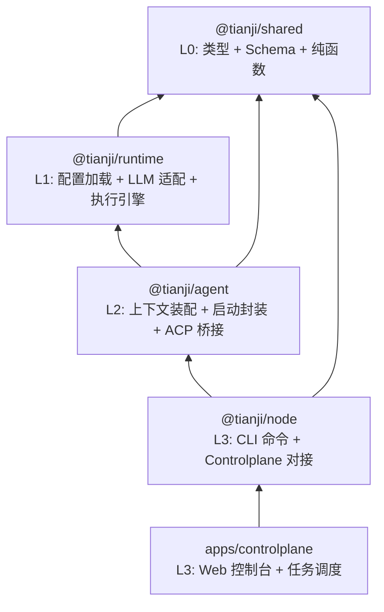
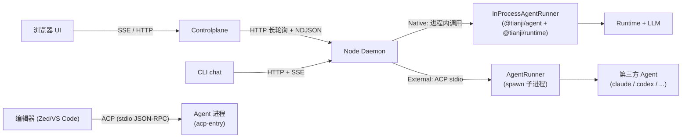
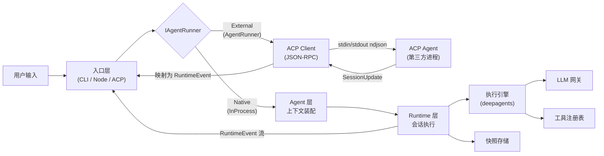
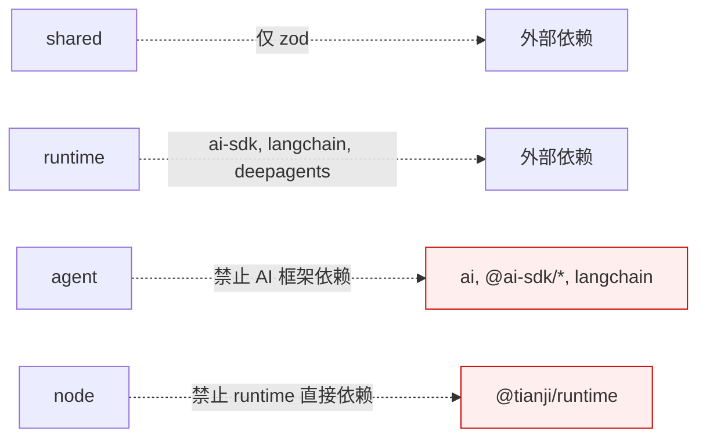

# Tianji AI 架构设计文档

> 状态：当前
> 日期：2026-04-07
> 相关文档：[`02 - CONFIG_DESIGN.md`](./02%20-%20CONFIG_DESIGN.md)、[`03 - RUNTIME_DESIGN.md`](./03%20-%20RUNTIME_DESIGN.md)、[`04 - OBSERVER_DESIGN.md`](./04%20-%20OBSERVER_DESIGN.md)、[`05 - AGENT_DESIGN.md`](./05%20-%20AGENT_DESIGN.md)、[`06 - CLI_GUIDE.md`](./06%20-%20CLI_GUIDE.md)、[`07 - DEVELOPMENT.md`](./07%20-%20DEVELOPMENT.md)

---

## 1. 分层架构

仓库采用 4 层分层结构，依赖方向严格自上而下：

| 层 | 包 | 核心职责 |
|----|----|---------|
| L0 | `@tianji/shared` | 公共类型、配置 Schema、纯函数、通用工具 |
| L1 | `@tianji/runtime` | 配置加载、LLM 网关、会话引擎、事件流、快照 |
| L2 | `@tianji/agent` | Agent 上下文装配、Session 封装、ACP 协议桥接 |
| L3 | `@tianji/node` | CLI 命令路由、Daemon 管理、Controlplane 连接 |
| L3 | `apps/controlplane` | Web UI、任务管理、Node 调度 |

---

## 2. 部署拓扑

Node 通过 `IAgentRunner` 统一接口支持两种 Agent 对接模式：

| 模式 | 判定条件 | Runner | 通信方式 | 适用场景 |
|------|---------|--------|---------|---------|
| **Native** | `command` 缺失或为 `tianji-agent` | `InProcessAgentRunner` | 进程内直接函数调用，零 IPC 开销 | tianji 自有 Agent |
| **External** | `command` 为其他值（如 `claude`、`codex`） | `AgentRunner` | spawn 子进程，stdin/stdout ndjson (ACP JSON-RPC 2.0) | 第三方 Agent |

> 类型判定逻辑见 `@tianji/shared` 中的 `resolveAgentType()` 函数。

### 接入路径

| 路径 | Agent 模式 | 通信方式 | 场景 |
|------|-----------|---------|------|
| Controlplane -> Node -> Native Agent | Native | HTTP + 进程内调用 | Web 控制台 + tianji 自有 Agent |
| Controlplane -> Node -> External Agent | External | HTTP + ACP stdio | Web 控制台 + 第三方 Agent |
| CLI -> Daemon -> Native Agent | Native | HTTP + SSE + 进程内调用 | 本地命令行对话 |
| 编辑器 -> Agent | — | ACP stdio | IDE 集成（独立 Agent 进程） |

---

## 3. 数据流转

### Native 模式流转

1. 入口层接收用户输入，通过 `InProcessAgentRunner` 直接调用 Agent 层
2. Agent 层加载配置、Agent 定义和 SOUL.md，组装运行上下文
3. Runtime 层创建会话、调度引擎执行 turn
4. 引擎在每个 turn 内交替调用 LLM 和工具，持续产出 `RuntimeEvent`
5. `RuntimeEvent` 直接 yield 回入口层，按场景渲染（终端、SSE）

### External 模式流转

1. 入口层接收用户输入，通过 `AgentRunner` spawn 子进程
2. `AgentRunner` 通过 ACP JSON-RPC 2.0 建立 Client 连接，执行握手 (`initialize` + `newSession`)
3. Client 发送 `prompt` 请求到子进程
4. 子进程内 ACP Agent 执行 Agent 逻辑，通过 `sessionUpdate` 通知回传事件
5. `AgentRunner` 将 ACP `SessionUpdate` 反向映射为 `RuntimeEvent`，yield 回入口层

> 事件映射关系：`agent_message_chunk` <-> `message.delta(text)`、`agent_thought_chunk` <-> `message.delta(thinking)`、`tool_call` <-> `tool.started`、`tool_call_update` <-> `tool.completed`

---

## 4. 依赖约束

| 包 | 允许的内部依赖 | 禁止依赖 |
|----|--------------|---------|
| `shared` | 无 | 所有内部包、AI 框架 |
| `runtime` | `shared` | `agent`、`apps/*` |
| `agent` | `shared`、`runtime` | AI 框架、Provider SDK、`apps/*` |
| `node` | `shared`、`agent` | `runtime`、AI 框架、Provider SDK |

核心原则：AI 框架依赖收敛在 runtime 内部，不外泄到上层。

---

## 5. 关键设计决策

| 决策 | 理由 | 权衡 |
|------|------|------|
| 协议层合并到 shared | 减少跨包引用，统一导入模型 | 基础层包体积略增 |
| LLM 能力收敛到 runtime | 不作为独立边界暴露，减少发布负担 | 未来若需独立消费 LLM 再拆分 |
| 引入 agent 装配层 | CLI/Web/Bot 共享上下文组装逻辑 | 多一层抽象，但职责清晰 |
| Native/External Agent 双模式 | Native 模式零 IPC 开销，External 模式支持第三方 Agent | 需要维护 ACP 事件双向映射 |
| `IAgentRunner` 统一接口 | TaskExecutor 和 Daemon 不感知具体 Agent 类型 | 新增 Runner 需实现完整接口 |

---

## 6. 不变量

- **配置系统**：三层 JSON 配置 (`default < user < workspace`)，`${env:VAR_NAME}` 占位符。详见 [02 - CONFIG_DESIGN.md](./02%20-%20CONFIG_DESIGN.md)
- **协议语义**：`RuntimeEvent`、Delta、Snapshot、错误模型
- **执行引擎**：deepagents
- **工具链**：pnpm workspace、Turborepo、Biome、Vitest、TypeScript strict mode
- **设计原则**：公共契约独立于框架实现；类型系统是架构约束的一部分；内部包不得各自读取配置文件

---

## 7. 演进方向

Agent 层为以下能力预留扩展空间：

- 多 agent 路由与组合（基于 `IAgentRunner` 接口扩展）
- Agent 间通信协议
- 任务规划器
- ACP 协议增强（会话恢复、权限桥接、Model/Mode 切换）

这些扩展在 agent 内部演进，不影响 runtime 核心引擎和 CLI 接口。
